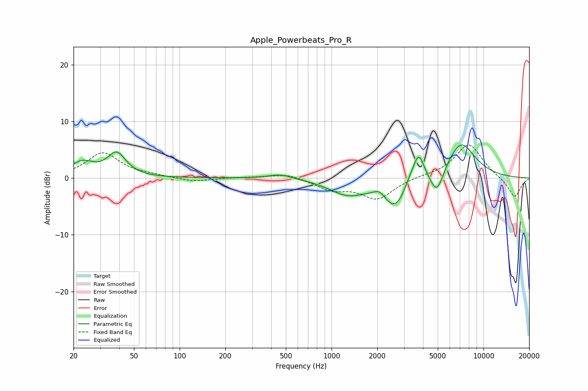

# Apple_Powerbeats_Pro_R
See [usage instructions](https://github.com/jaakkopasanen/AutoEq#usage) for more options and info.

### Parametric EQs
Apply preamp of -5.9 dB when using parametric equalizer.

|   # | Type    |   Fc (Hz) |    Q |   Gain (dB) |
|-----|---------|-----------|------|-------------|
|   1 | Peaking |        23 | 1.83 |         2.6 |
|   2 | Peaking |        38 | 2.35 |         4.1 |
|   3 | Peaking |       464 | 1.71 |         0.8 |
|   4 | Peaking |      1268 | 1.17 |        -2.6 |
|   5 | Peaking |      2068 | 3.65 |         1.4 |
|   6 | Peaking |      2654 | 1.61 |        -5.7 |
|   7 | Peaking |      3233 | 3.12 |         1.6 |
|   8 | Peaking |      3741 | 3.71 |         5.2 |
|   9 | Peaking |      4940 | 3.18 |        -4.4 |
|  10 | Peaking |      7081 | 1.4  |         6.5 |

### Fixed Band EQs
When using fixed band (also called graphic) equalizer, apply preamp of **-5.9 dB** (if available) and set gains manually with these parameters.

|   # | Type    |   Fc (Hz) |    Q |   Gain (dB) |
|-----|---------|-----------|------|-------------|
|   1 | Peaking |        31 | 1.41 |         4.4 |
|   2 | Peaking |        62 | 1.41 |         0.3 |
|   3 | Peaking |       125 | 1.41 |        -0.7 |
|   4 | Peaking |       250 | 1.41 |         0.1 |
|   5 | Peaking |       500 | 1.41 |         0.9 |
|   6 | Peaking |      1000 | 1.41 |        -1.9 |
|   7 | Peaking |      2000 | 1.41 |        -3.6 |
|   8 | Peaking |      4000 | 1.41 |         0.3 |
|   9 | Peaking |      8000 | 1.41 |         6.1 |
|  10 | Peaking |     16000 | 1.41 |        -3.5 |

### Graphs

