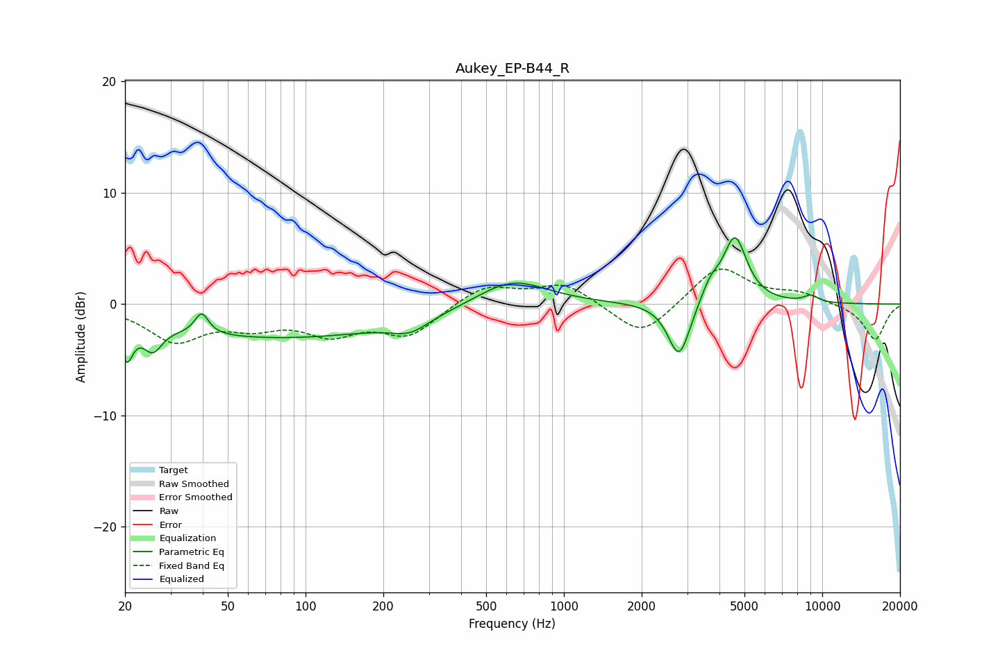

# Aukey_EP-B44_R
See [usage instructions](https://github.com/jaakkopasanen/AutoEq#usage) for more options and info.

### Parametric EQs
Apply preamp of -6.0 dB when using parametric equalizer.

|   # | Type    |   Fc (Hz) |    Q |   Gain (dB) |
|-----|---------|-----------|------|-------------|
|   1 | Peaking |        20 | 5.96 |        -3.3 |
|   2 | Peaking |        26 | 3.95 |        -2.2 |
|   3 | Peaking |        40 | 5.48 |         1.9 |
|   4 | Peaking |        79 | 0.28 |        -3   |
|   5 | Peaking |       254 | 1.97 |        -1.2 |
|   6 | Peaking |       628 | 1.03 |         2.5 |
|   7 | Peaking |      2793 | 3.29 |        -5.1 |
|   8 | Peaking |      3686 | 3.86 |         1.6 |
|   9 | Peaking |      4593 | 3.03 |         5.9 |
|  10 | Peaking |      9054 | 4.39 |         0.6 |

### Fixed Band EQs
When using fixed band (also called graphic) equalizer, apply preamp of **-3.2 dB** (if available) and set gains manually with these parameters.

|   # | Type    |   Fc (Hz) |    Q |   Gain (dB) |
|-----|---------|-----------|------|-------------|
|   1 | Peaking |        31 | 1.41 |        -3.1 |
|   2 | Peaking |        62 | 1.41 |        -1.6 |
|   3 | Peaking |       125 | 1.41 |        -2.3 |
|   4 | Peaking |       250 | 1.41 |        -2.7 |
|   5 | Peaking |       500 | 1.41 |         1.8 |
|   6 | Peaking |      1000 | 1.41 |         1.9 |
|   7 | Peaking |      2000 | 1.41 |        -3.1 |
|   8 | Peaking |      4000 | 1.41 |         3.5 |
|   9 | Peaking |      8000 | 1.41 |         0.9 |
|  10 | Peaking |     16000 | 1.41 |        -3.2 |

### Graphs

