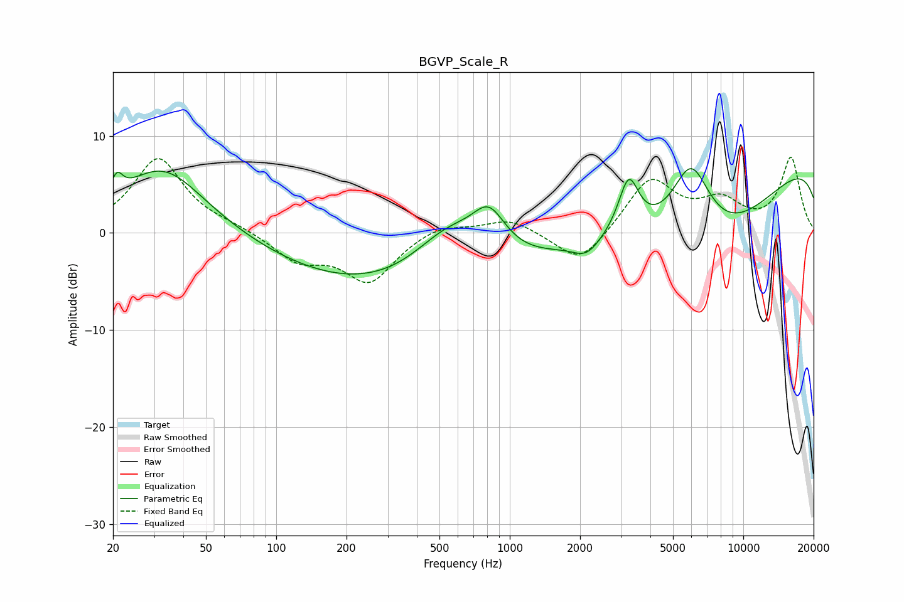

# BGVP_Scale_R
See [usage instructions](https://github.com/jaakkopasanen/AutoEq#usage) for more options and info.

### Parametric EQs
Apply preamp of -6.7 dB when using parametric equalizer.

|   # | Type    |   Fc (Hz) |    Q |   Gain (dB) |
|-----|---------|-----------|------|-------------|
|   1 | Peaking |        21 | 5.98 |         2   |
|   2 | Peaking |        33 | 0.77 |         7   |
|   3 | Peaking |       389 | 0.25 |        -6.4 |
|   4 | Peaking |       546 | 0.89 |         5.4 |
|   5 | Peaking |       815 | 1.94 |         4.4 |
|   6 | Peaking |      2133 | 2.48 |        -1.6 |
|   7 | Peaking |      3230 | 3.2  |         5.8 |
|   8 | Peaking |      5982 | 1.49 |         9.1 |
|   9 | Peaking |      6892 | 0.36 |       -14.1 |
|  10 | Peaking |     10000 | 0.18 |        12.4 |

### Fixed Band EQs
When using fixed band (also called graphic) equalizer, apply preamp of **-7.9 dB** (if available) and set gains manually with these parameters.

|   # | Type    |   Fc (Hz) |    Q |   Gain (dB) |
|-----|---------|-----------|------|-------------|
|   1 | Peaking |        31 | 1.41 |         7.7 |
|   2 | Peaking |        62 | 1.41 |         0.5 |
|   3 | Peaking |       125 | 1.41 |        -2.7 |
|   4 | Peaking |       250 | 1.41 |        -4.9 |
|   5 | Peaking |       500 | 1.41 |         1   |
|   6 | Peaking |      1000 | 1.41 |         1.5 |
|   7 | Peaking |      2000 | 1.41 |        -3.5 |
|   8 | Peaking |      4000 | 1.41 |         5.5 |
|   9 | Peaking |      8000 | 1.41 |         2.8 |
|  10 | Peaking |     16000 | 1.41 |         7.7 |

### Graphs

