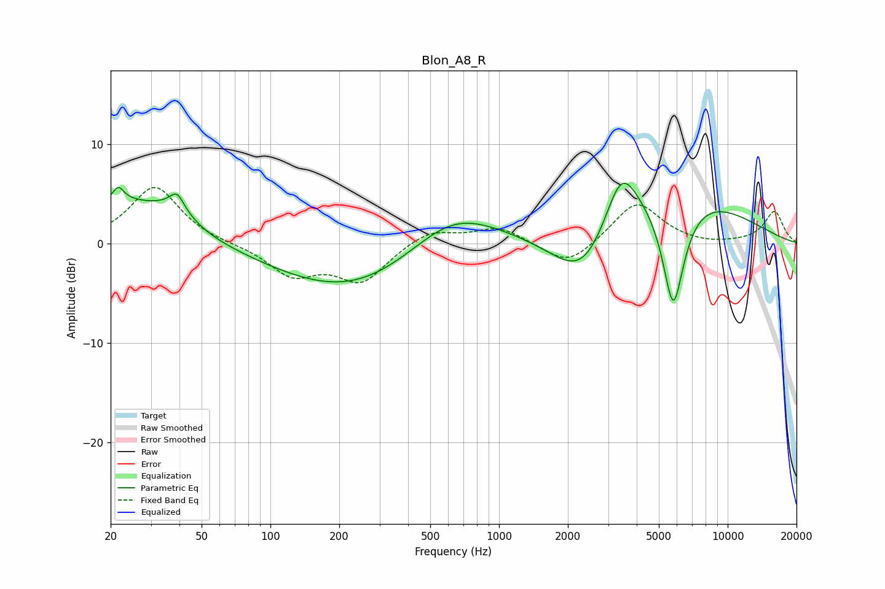

# Blon_A8_R
See [usage instructions](https://github.com/jaakkopasanen/AutoEq#usage) for more options and info.

### Parametric EQs
Apply preamp of -6.2 dB when using parametric equalizer.

|   # | Type    |   Fc (Hz) |    Q |   Gain (dB) |
|-----|---------|-----------|------|-------------|
|   1 | Peaking |        22 | 5.79 |         1.5 |
|   2 | Peaking |        23 | 0.65 |         4.1 |
|   3 | Peaking |        38 | 1.74 |         1.6 |
|   4 | Peaking |        39 | 5.02 |         1.5 |
|   5 | Peaking |       233 | 0.42 |        -5   |
|   6 | Peaking |       623 | 0.69 |         4.5 |
|   7 | Peaking |      2358 | 0.95 |        -7.2 |
|   8 | Peaking |      3415 | 1.98 |         5.7 |
|   9 | Peaking |      5058 | 0.42 |         6.9 |
|  10 | Peaking |      5780 | 2.67 |       -12   |

### Fixed Band EQs
When using fixed band (also called graphic) equalizer, apply preamp of **-5.8 dB** (if available) and set gains manually with these parameters.

|   # | Type    |   Fc (Hz) |    Q |   Gain (dB) |
|-----|---------|-----------|------|-------------|
|   1 | Peaking |        31 | 1.41 |         5.8 |
|   2 | Peaking |        62 | 1.41 |        -0   |
|   3 | Peaking |       125 | 1.41 |        -3   |
|   4 | Peaking |       250 | 1.41 |        -3.7 |
|   5 | Peaking |       500 | 1.41 |         1.5 |
|   6 | Peaking |      1000 | 1.41 |         1.7 |
|   7 | Peaking |      2000 | 1.41 |        -2.4 |
|   8 | Peaking |      4000 | 1.41 |         4.3 |
|   9 | Peaking |      8000 | 1.41 |        -0.2 |
|  10 | Peaking |     16000 | 1.41 |         3.2 |

### Graphs

