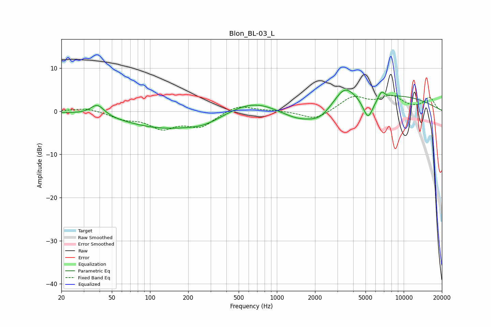

# Blon_BL-03_L
See [usage instructions](https://github.com/jaakkopasanen/AutoEq#usage) for more options and info.

### Parametric EQs
Apply preamp of -5.0 dB when using parametric equalizer.

|   # | Type    |   Fc (Hz) |    Q |   Gain (dB) |
|-----|---------|-----------|------|-------------|
|   1 | Peaking |        38 | 2.64 |         2.6 |
|   2 | Peaking |       128 | 0.45 |        -3.8 |
|   3 | Peaking |       270 | 1.08 |        -1.5 |
|   4 | Peaking |       666 | 0.72 |         3   |
|   5 | Peaking |      1559 | 0.83 |        -3.2 |
|   6 | Peaking |      2208 | 1.76 |        -1.7 |
|   7 | Peaking |      3421 | 1.76 |         4.1 |
|   8 | Peaking |      5233 | 3.33 |        -5.2 |
|   9 | Peaking |      6684 | 5.61 |         1.7 |
|  10 | Peaking |      7560 | 0.33 |         3.7 |

### Fixed Band EQs
When using fixed band (also called graphic) equalizer, apply preamp of **-3.8 dB** (if available) and set gains manually with these parameters.

|   # | Type    |   Fc (Hz) |    Q |   Gain (dB) |
|-----|---------|-----------|------|-------------|
|   1 | Peaking |        31 | 1.41 |         0.9 |
|   2 | Peaking |        62 | 1.41 |        -1.5 |
|   3 | Peaking |       125 | 1.41 |        -3.6 |
|   4 | Peaking |       250 | 1.41 |        -3.3 |
|   5 | Peaking |       500 | 1.41 |         1.7 |
|   6 | Peaking |      1000 | 1.41 |         0.2 |
|   7 | Peaking |      2000 | 1.41 |        -2.1 |
|   8 | Peaking |      4000 | 1.41 |         3.3 |
|   9 | Peaking |      8000 | 1.41 |         3.2 |
|  10 | Peaking |     16000 | 1.41 |         3.1 |

### Graphs

