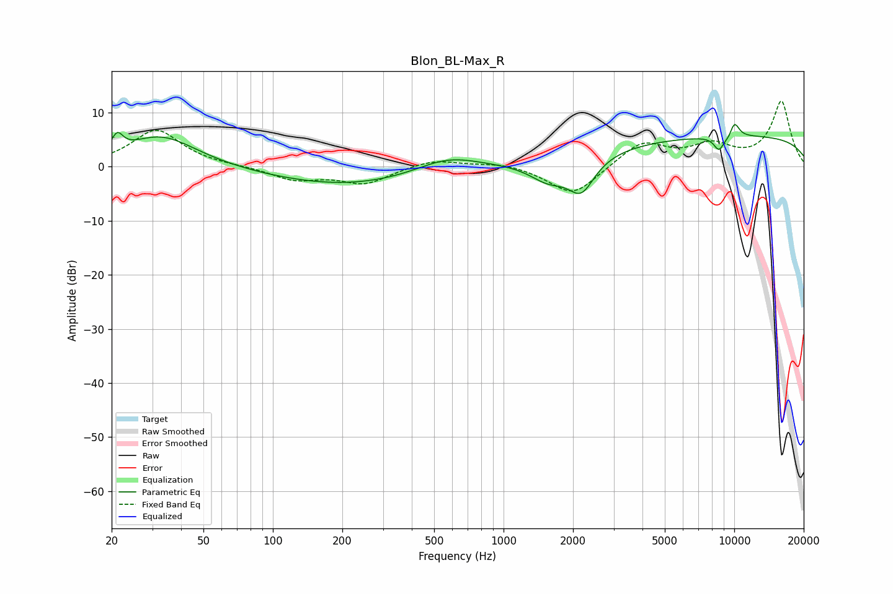

# Blon_BL-Max_R
See [usage instructions](https://github.com/jaakkopasanen/AutoEq#usage) for more options and info.

### Parametric EQs
Apply preamp of -7.9 dB when using parametric equalizer.

|   # | Type    |   Fc (Hz) |    Q |   Gain (dB) |
|-----|---------|-----------|------|-------------|
|   1 | Peaking |        21 | 5.87 |         3.1 |
|   2 | Peaking |        33 | 0.91 |         5.8 |
|   3 | Peaking |       215 | 0.4  |        -3.6 |
|   4 | Peaking |       569 | 0.99 |         3   |
|   5 | Peaking |      1563 | 1.7  |        -3.5 |
|   6 | Peaking |      2174 | 2.39 |        -6.2 |
|   7 | Peaking |      8582 | 5.78 |        -2.6 |
|   8 | Peaking |      9509 | 6    |        -0.8 |
|   9 | Peaking |     10000 | 5.71 |         3   |
|  10 | Peaking |     10000 | 0.18 |         5.7 |

### Fixed Band EQs
When using fixed band (also called graphic) equalizer, apply preamp of **-12.2 dB** (if available) and set gains manually with these parameters.

|   # | Type    |   Fc (Hz) |    Q |   Gain (dB) |
|-----|---------|-----------|------|-------------|
|   1 | Peaking |        31 | 1.41 |         6.8 |
|   2 | Peaking |        62 | 1.41 |         0   |
|   3 | Peaking |       125 | 1.41 |        -2.4 |
|   4 | Peaking |       250 | 1.41 |        -3   |
|   5 | Peaking |       500 | 1.41 |         1.5 |
|   6 | Peaking |      1000 | 1.41 |         0.8 |
|   7 | Peaking |      2000 | 1.41 |        -5.6 |
|   8 | Peaking |      4000 | 1.41 |         4.6 |
|   9 | Peaking |      8000 | 1.41 |         3.5 |
|  10 | Peaking |     16000 | 1.41 |        12   |

### Graphs

