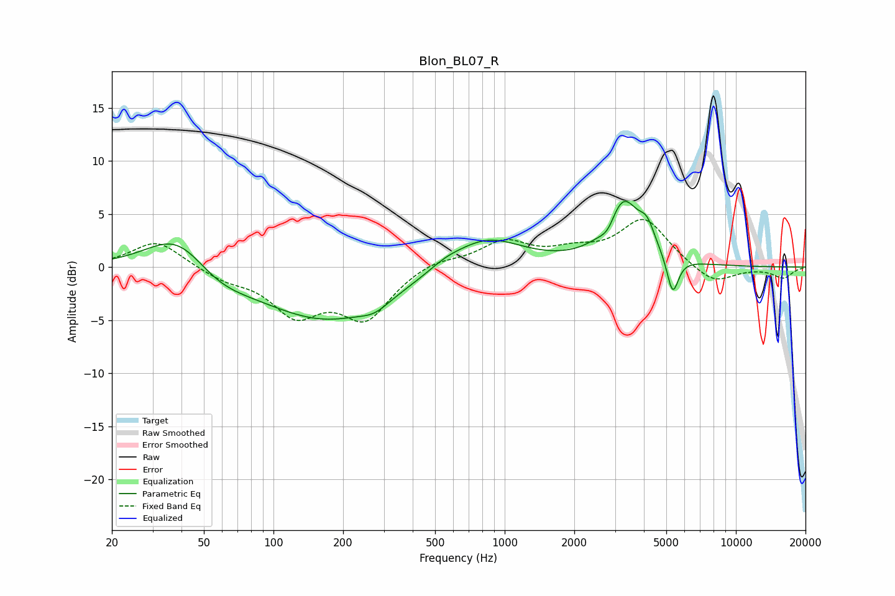

# Blon_BL07_R
See [usage instructions](https://github.com/jaakkopasanen/AutoEq#usage) for more options and info.

### Parametric EQs
Apply preamp of -6.3 dB when using parametric equalizer.

|   # | Type    |   Fc (Hz) |    Q |   Gain (dB) |
|-----|---------|-----------|------|-------------|
|   1 | Peaking |        39 | 1.04 |         3.9 |
|   2 | Peaking |        57 | 1.08 |        -1.6 |
|   3 | Peaking |       171 | 0.5  |        -5   |
|   4 | Peaking |       274 | 2.28 |        -0.8 |
|   5 | Peaking |       550 | 1.96 |         0.5 |
|   6 | Peaking |       826 | 0.9  |         3.1 |
|   7 | Peaking |      2802 | 4.02 |        -1.3 |
|   8 | Peaking |      3237 | 1.92 |         6.2 |
|   9 | Peaking |      4133 | 4.15 |         1.9 |
|  10 | Peaking |      5329 | 5.57 |        -3.6 |

### Fixed Band EQs
When using fixed band (also called graphic) equalizer, apply preamp of **-4.6 dB** (if available) and set gains manually with these parameters.

|   # | Type    |   Fc (Hz) |    Q |   Gain (dB) |
|-----|---------|-----------|------|-------------|
|   1 | Peaking |        31 | 1.41 |         2.6 |
|   2 | Peaking |        62 | 1.41 |        -1   |
|   3 | Peaking |       125 | 1.41 |        -4.1 |
|   4 | Peaking |       250 | 1.41 |        -4.6 |
|   5 | Peaking |       500 | 1.41 |         0.8 |
|   6 | Peaking |      1000 | 1.41 |         2.3 |
|   7 | Peaking |      2000 | 1.41 |         1.2 |
|   8 | Peaking |      4000 | 1.41 |         4.5 |
|   9 | Peaking |      8000 | 1.41 |        -1.7 |
|  10 | Peaking |     16000 | 1.41 |        -1   |

### Graphs

