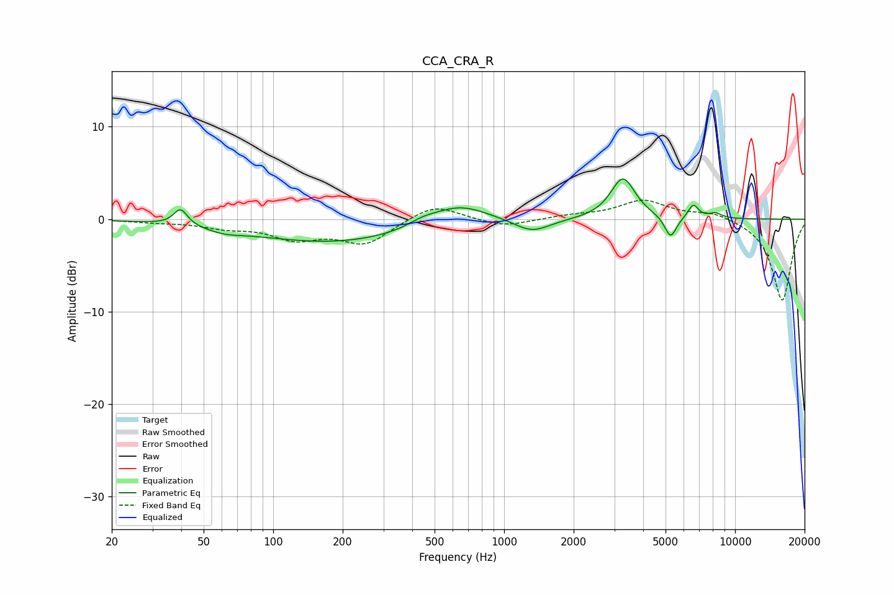

# CCA_CRA_R
See [usage instructions](https://github.com/jaakkopasanen/AutoEq#usage) for more options and info.

### Parametric EQs
Apply preamp of -4.4 dB when using parametric equalizer.

|   # | Type    |   Fc (Hz) |    Q |   Gain (dB) |
|-----|---------|-----------|------|-------------|
|   1 | Peaking |        40 | 4.87 |         1.8 |
|   2 | Peaking |        62 | 1.87 |        -0.5 |
|   3 | Peaking |       185 | 0.39 |        -2.5 |
|   4 | Peaking |       443 | 2.27 |         0.6 |
|   5 | Peaking |       633 | 1.11 |         2.2 |
|   6 | Peaking |      1320 | 1.81 |        -1.5 |
|   7 | Peaking |      3270 | 2.66 |         4.5 |
|   8 | Peaking |      5259 | 5.42 |        -2.4 |
|   9 | Peaking |      6593 | 6    |         1.5 |
|  10 | Peaking |      8219 | 4.66 |         0.5 |

### Fixed Band EQs
When using fixed band (also called graphic) equalizer, apply preamp of **-2.1 dB** (if available) and set gains manually with these parameters.

|   # | Type    |   Fc (Hz) |    Q |   Gain (dB) |
|-----|---------|-----------|------|-------------|
|   1 | Peaking |        31 | 1.41 |        -0.3 |
|   2 | Peaking |        62 | 1.41 |        -0.7 |
|   3 | Peaking |       125 | 1.41 |        -1.9 |
|   4 | Peaking |       250 | 1.41 |        -2.6 |
|   5 | Peaking |       500 | 1.41 |         1.7 |
|   6 | Peaking |      1000 | 1.41 |        -0.9 |
|   7 | Peaking |      2000 | 1.41 |         0.4 |
|   8 | Peaking |      4000 | 1.41 |         2   |
|   9 | Peaking |      8000 | 1.41 |         0.8 |
|  10 | Peaking |     16000 | 1.41 |        -8.9 |

### Graphs

