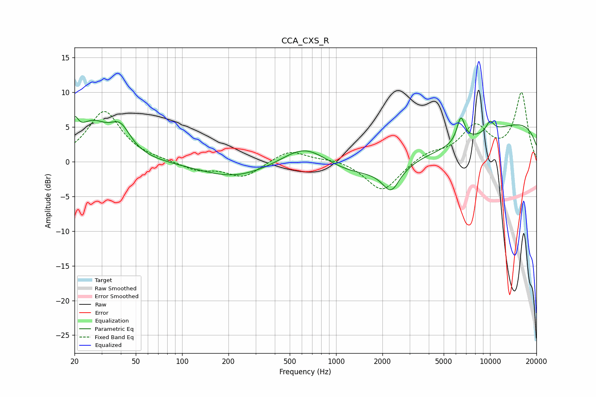

# CCA_CXS_R
See [usage instructions](https://github.com/jaakkopasanen/AutoEq#usage) for more options and info.

### Parametric EQs
Apply preamp of -6.6 dB when using parametric equalizer.

|   # | Type    |   Fc (Hz) |    Q |   Gain (dB) |
|-----|---------|-----------|------|-------------|
|   1 | Peaking |        20 | 5.99 |         2.9 |
|   2 | Peaking |        26 | 1.34 |         4.9 |
|   3 | Peaking |        40 | 2.1  |         3.6 |
|   4 | Peaking |       213 | 0.65 |        -2.1 |
|   5 | Peaking |       634 | 0.88 |         4.3 |
|   6 | Peaking |      2278 | 2.54 |        -3.5 |
|   7 | Peaking |      2797 | 0.2  |        -4.8 |
|   8 | Peaking |      6465 | 5.27 |         3.6 |
|   9 | Peaking |     10000 | 4.78 |         1.6 |
|  10 | Peaking |     10000 | 0.18 |         7.1 |

### Fixed Band EQs
When using fixed band (also called graphic) equalizer, apply preamp of **-10.1 dB** (if available) and set gains manually with these parameters.

|   # | Type    |   Fc (Hz) |    Q |   Gain (dB) |
|-----|---------|-----------|------|-------------|
|   1 | Peaking |        31 | 1.41 |         7.3 |
|   2 | Peaking |        62 | 1.41 |         0.1 |
|   3 | Peaking |       125 | 1.41 |        -1.2 |
|   4 | Peaking |       250 | 1.41 |        -2.2 |
|   5 | Peaking |       500 | 1.41 |         1.8 |
|   6 | Peaking |      1000 | 1.41 |         0.4 |
|   7 | Peaking |      2000 | 1.41 |        -4.4 |
|   8 | Peaking |      4000 | 1.41 |         1.2 |
|   9 | Peaking |      8000 | 1.41 |         4.8 |
|  10 | Peaking |     16000 | 1.41 |         9.8 |

### Graphs

