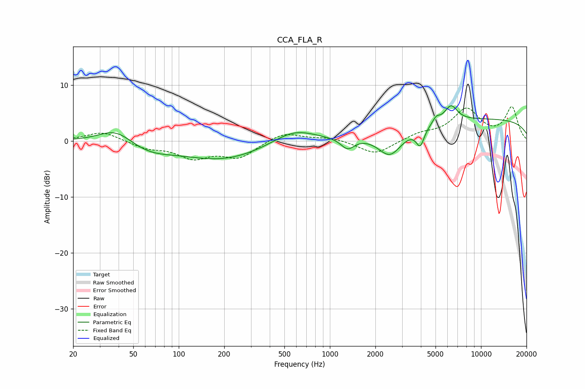

# CCA_FLA_R
See [usage instructions](https://github.com/jaakkopasanen/AutoEq#usage) for more options and info.

### Parametric EQs
Apply preamp of -6.4 dB when using parametric equalizer.

|   # | Type    |   Fc (Hz) |    Q |   Gain (dB) |
|-----|---------|-----------|------|-------------|
|   1 | Peaking |        38 | 1.27 |         2.6 |
|   2 | Peaking |        64 | 0.97 |        -1.7 |
|   3 | Peaking |       195 | 0.52 |        -3.3 |
|   4 | Peaking |       578 | 1.01 |         2.5 |
|   5 | Peaking |      1310 | 3.12 |        -2.1 |
|   6 | Peaking |      2500 | 1.75 |        -4.6 |
|   7 | Peaking |      3962 | 5.29 |        -3.2 |
|   8 | Peaking |      5051 | 5.92 |         1   |
|   9 | Peaking |      6328 | 3.24 |         2.8 |
|  10 | Peaking |     10000 | 0.18 |         3.9 |

### Fixed Band EQs
When using fixed band (also called graphic) equalizer, apply preamp of **-6.2 dB** (if available) and set gains manually with these parameters.

|   # | Type    |   Fc (Hz) |    Q |   Gain (dB) |
|-----|---------|-----------|------|-------------|
|   1 | Peaking |        31 | 1.41 |         1.7 |
|   2 | Peaking |        62 | 1.41 |        -1.2 |
|   3 | Peaking |       125 | 1.41 |        -2.8 |
|   4 | Peaking |       250 | 1.41 |        -2.8 |
|   5 | Peaking |       500 | 1.41 |         1.6 |
|   6 | Peaking |      1000 | 1.41 |         0.6 |
|   7 | Peaking |      2000 | 1.41 |        -2.5 |
|   8 | Peaking |      4000 | 1.41 |         1.1 |
|   9 | Peaking |      8000 | 1.41 |         5.5 |
|  10 | Peaking |     16000 | 1.41 |         5.9 |

### Graphs

