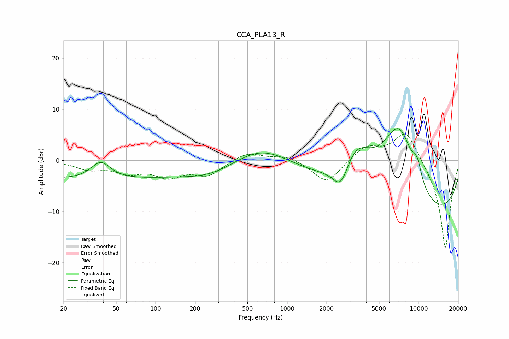

# CCA_PLA13_R
See [usage instructions](https://github.com/jaakkopasanen/AutoEq#usage) for more options and info.

### Parametric EQs
Apply preamp of -6.3 dB when using parametric equalizer.

|   # | Type    |   Fc (Hz) |    Q |   Gain (dB) |
|-----|---------|-----------|------|-------------|
|   1 | Peaking |        30 | 0.18 |        -3.7 |
|   2 | Peaking |        38 | 1.96 |         3.4 |
|   3 | Peaking |       267 | 0.65 |        -2.6 |
|   4 | Peaking |       637 | 0.66 |         3.8 |
|   5 | Peaking |      2571 | 2.27 |        -5.4 |
|   6 | Peaking |      3327 | 1.06 |         8.7 |
|   7 | Peaking |      6766 | 0.82 |        11.2 |
|   8 | Peaking |      7344 | 1.41 |         5.9 |
|   9 | Peaking |      8908 | 0.19 |       -13   |
|  10 | Peaking |      9783 | 3.65 |         3.4 |

### Fixed Band EQs
When using fixed band (also called graphic) equalizer, apply preamp of **-5.2 dB** (if available) and set gains manually with these parameters.

|   # | Type    |   Fc (Hz) |    Q |   Gain (dB) |
|-----|---------|-----------|------|-------------|
|   1 | Peaking |        31 | 1.41 |        -1.6 |
|   2 | Peaking |        62 | 1.41 |        -2   |
|   3 | Peaking |       125 | 1.41 |        -2.8 |
|   4 | Peaking |       250 | 1.41 |        -2.7 |
|   5 | Peaking |       500 | 1.41 |         1.7 |
|   6 | Peaking |      1000 | 1.41 |         1   |
|   7 | Peaking |      2000 | 1.41 |        -4.5 |
|   8 | Peaking |      4000 | 1.41 |         2.8 |
|   9 | Peaking |      8000 | 1.41 |         6.2 |
|  10 | Peaking |     16000 | 1.41 |       -17.5 |

### Graphs

