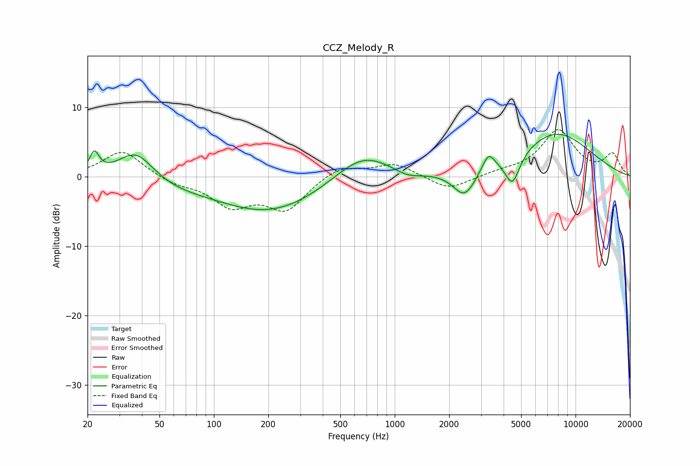

# CCZ_Melody_R
See [usage instructions](https://github.com/jaakkopasanen/AutoEq#usage) for more options and info.

### Parametric EQs
Apply preamp of -6.2 dB when using parametric equalizer.

|   # | Type    |   Fc (Hz) |    Q |   Gain (dB) |
|-----|---------|-----------|------|-------------|
|   1 | Peaking |        22 | 5.55 |         2.9 |
|   2 | Peaking |        37 | 1.43 |         4.2 |
|   3 | Peaking |        60 | 0.86 |        -0.9 |
|   4 | Peaking |       204 | 0.47 |        -5.2 |
|   5 | Peaking |       663 | 0.89 |         4.2 |
|   6 | Peaking |      1181 | 1.82 |        -1   |
|   7 | Peaking |      2434 | 2.25 |        -3.9 |
|   8 | Peaking |      3301 | 4.05 |         2.5 |
|   9 | Peaking |      4476 | 3.47 |        -4.3 |
|  10 | Peaking |      7767 | 0.63 |         6.3 |

### Fixed Band EQs
When using fixed band (also called graphic) equalizer, apply preamp of **-6.9 dB** (if available) and set gains manually with these parameters.

|   # | Type    |   Fc (Hz) |    Q |   Gain (dB) |
|-----|---------|-----------|------|-------------|
|   1 | Peaking |        31 | 1.41 |         3.8 |
|   2 | Peaking |        62 | 1.41 |        -1   |
|   3 | Peaking |       125 | 1.41 |        -3.9 |
|   4 | Peaking |       250 | 1.41 |        -4.6 |
|   5 | Peaking |       500 | 1.41 |         1.6 |
|   6 | Peaking |      1000 | 1.41 |         1.9 |
|   7 | Peaking |      2000 | 1.41 |        -2   |
|   8 | Peaking |      4000 | 1.41 |         0.5 |
|   9 | Peaking |      8000 | 1.41 |         6.6 |
|  10 | Peaking |     16000 | 1.41 |         3.1 |

### Graphs

