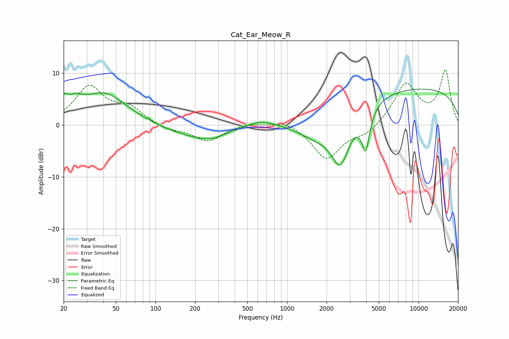

# Cat_Ear_Meow_R
See [usage instructions](https://github.com/jaakkopasanen/AutoEq#usage) for more options and info.

### Parametric EQs
Apply preamp of -7.0 dB when using parametric equalizer.

|   # | Type    |   Fc (Hz) |    Q |   Gain (dB) |
|-----|---------|-----------|------|-------------|
|   1 | Peaking |        20 | 5.44 |         2.4 |
|   2 | Peaking |        24 | 2.34 |         2.4 |
|   3 | Peaking |        41 | 0.83 |         6   |
|   4 | Peaking |       206 | 0.63 |        -2.5 |
|   5 | Peaking |       270 | 1.84 |        -0.7 |
|   6 | Peaking |       631 | 1.31 |         1.3 |
|   7 | Peaking |      1691 | 0.9  |        -3.9 |
|   8 | Peaking |      2549 | 1.91 |        -9.7 |
|   9 | Peaking |      3965 | 4.47 |        -7.8 |
|  10 | Peaking |      8849 | 0.18 |         7.2 |

### Fixed Band EQs
When using fixed band (also called graphic) equalizer, apply preamp of **-10.7 dB** (if available) and set gains manually with these parameters.

|   # | Type    |   Fc (Hz) |    Q |   Gain (dB) |
|-----|---------|-----------|------|-------------|
|   1 | Peaking |        31 | 1.41 |         7.2 |
|   2 | Peaking |        62 | 1.41 |         3   |
|   3 | Peaking |       125 | 1.41 |        -1   |
|   4 | Peaking |       250 | 1.41 |        -3.1 |
|   5 | Peaking |       500 | 1.41 |         0.5 |
|   6 | Peaking |      1000 | 1.41 |         1.1 |
|   7 | Peaking |      2000 | 1.41 |        -6.6 |
|   8 | Peaking |      4000 | 1.41 |        -1.8 |
|   9 | Peaking |      8000 | 1.41 |         7.9 |
|  10 | Peaking |     16000 | 1.41 |        10.3 |

### Graphs

