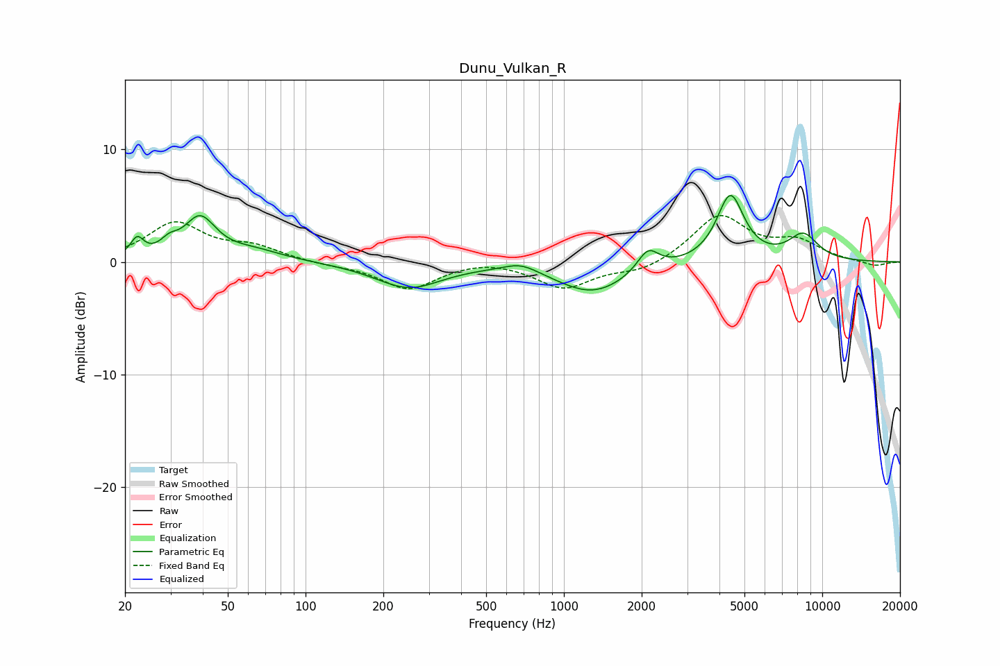

# Dunu_Vulkan_R
See [usage instructions](https://github.com/jaakkopasanen/AutoEq#usage) for more options and info.

### Parametric EQs
Apply preamp of -6.0 dB when using parametric equalizer.

|   # | Type    |   Fc (Hz) |    Q |   Gain (dB) |
|-----|---------|-----------|------|-------------|
|   1 | Peaking |        22 | 5.66 |         1.6 |
|   2 | Peaking |        30 | 4.21 |         0.9 |
|   3 | Peaking |        39 | 2.33 |         3.6 |
|   4 | Peaking |        63 | 1.22 |         0.9 |
|   5 | Peaking |       251 | 1.1  |        -2.3 |
|   6 | Peaking |       682 | 2.07 |         0.8 |
|   7 | Peaking |      1293 | 1    |        -2.7 |
|   8 | Peaking |      2116 | 3.42 |         2   |
|   9 | Peaking |      4409 | 2.69 |         5.9 |
|  10 | Peaking |      8444 | 2.24 |         2.3 |

### Fixed Band EQs
When using fixed band (also called graphic) equalizer, apply preamp of **-4.2 dB** (if available) and set gains manually with these parameters.

|   # | Type    |   Fc (Hz) |    Q |   Gain (dB) |
|-----|---------|-----------|------|-------------|
|   1 | Peaking |        31 | 1.41 |         3.4 |
|   2 | Peaking |        62 | 1.41 |         1.2 |
|   3 | Peaking |       125 | 1.41 |        -0.2 |
|   4 | Peaking |       250 | 1.41 |        -2.4 |
|   5 | Peaking |       500 | 1.41 |         0.4 |
|   6 | Peaking |      1000 | 1.41 |        -2.3 |
|   7 | Peaking |      2000 | 1.41 |        -0.9 |
|   8 | Peaking |      4000 | 1.41 |         4.1 |
|   9 | Peaking |      8000 | 1.41 |         1.6 |
|  10 | Peaking |     16000 | 1.41 |        -0.4 |

### Graphs

