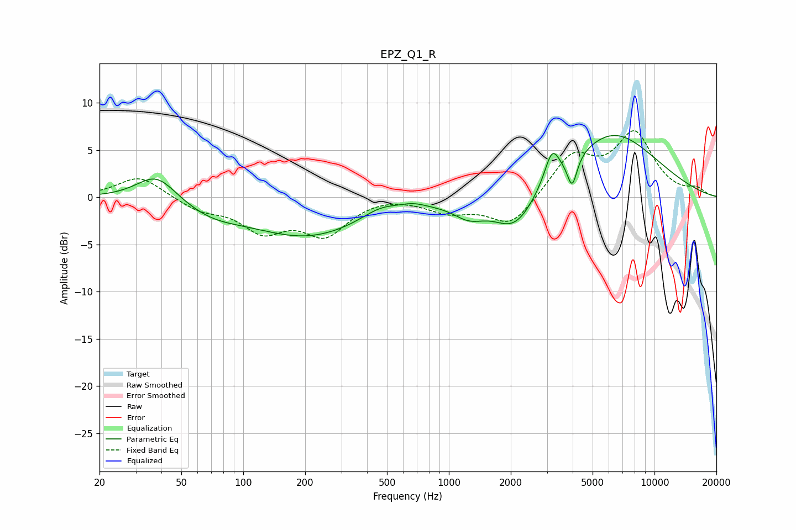

# EPZ_Q1_R
See [usage instructions](https://github.com/jaakkopasanen/AutoEq#usage) for more options and info.

### Parametric EQs
Apply preamp of -6.6 dB when using parametric equalizer.

|   # | Type    |   Fc (Hz) |    Q |   Gain (dB) |
|-----|---------|-----------|------|-------------|
|   1 | Peaking |        38 | 1.46 |         2.9 |
|   2 | Peaking |        70 | 0.97 |        -1.3 |
|   3 | Peaking |       206 | 0.5  |        -4.1 |
|   4 | Peaking |       465 | 1.55 |         1.1 |
|   5 | Peaking |       668 | 2.35 |         0.5 |
|   6 | Peaking |      1254 | 1.82 |        -1.6 |
|   7 | Peaking |      2098 | 1.36 |        -4.1 |
|   8 | Peaking |      3178 | 3.97 |         3.2 |
|   9 | Peaking |      3978 | 6    |        -3.2 |
|  10 | Peaking |      6224 | 0.61 |         6.8 |

### Fixed Band EQs
When using fixed band (also called graphic) equalizer, apply preamp of **-7.1 dB** (if available) and set gains manually with these parameters.

|   # | Type    |   Fc (Hz) |    Q |   Gain (dB) |
|-----|---------|-----------|------|-------------|
|   1 | Peaking |        31 | 1.41 |         2.3 |
|   2 | Peaking |        62 | 1.41 |        -1.2 |
|   3 | Peaking |       125 | 1.41 |        -3.3 |
|   4 | Peaking |       250 | 1.41 |        -3.7 |
|   5 | Peaking |       500 | 1.41 |         0.3 |
|   6 | Peaking |      1000 | 1.41 |        -1.4 |
|   7 | Peaking |      2000 | 1.41 |        -3.1 |
|   8 | Peaking |      4000 | 1.41 |         4.3 |
|   9 | Peaking |      8000 | 1.41 |         6.5 |
|  10 | Peaking |     16000 | 1.41 |         0.8 |

### Graphs

