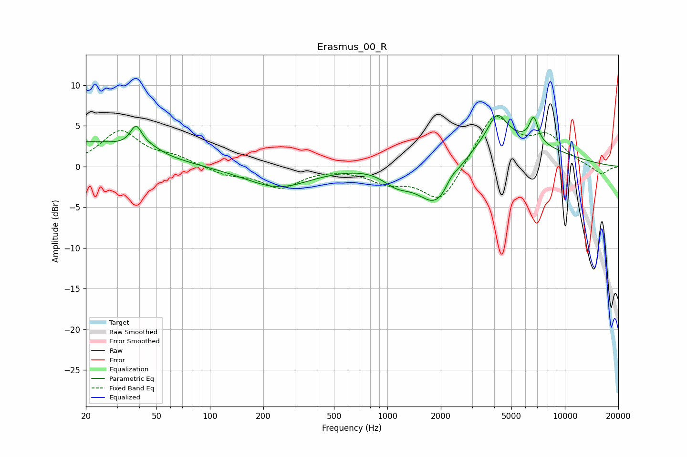

# Erasmus_00_R
See [usage instructions](https://github.com/jaakkopasanen/AutoEq#usage) for more options and info.

### Parametric EQs
Apply preamp of -6.4 dB when using parametric equalizer.

|   # | Type    |   Fc (Hz) |    Q |   Gain (dB) |
|-----|---------|-----------|------|-------------|
|   1 | Peaking |        20 | 0.46 |         3   |
|   2 | Peaking |        38 | 4.44 |         2.5 |
|   3 | Peaking |        46 | 2.09 |         0.7 |
|   4 | Peaking |       242 | 0.76 |        -2.6 |
|   5 | Peaking |      1126 | 1.72 |        -1.9 |
|   6 | Peaking |      1919 | 1.12 |        -8   |
|   7 | Peaking |      2289 | 3.96 |         1   |
|   8 | Peaking |      3206 | 0.39 |         4.9 |
|   9 | Peaking |      4160 | 2.72 |         3.3 |
|  10 | Peaking |      6675 | 5.65 |         3   |

### Fixed Band EQs
When using fixed band (also called graphic) equalizer, apply preamp of **-6.2 dB** (if available) and set gains manually with these parameters.

|   # | Type    |   Fc (Hz) |    Q |   Gain (dB) |
|-----|---------|-----------|------|-------------|
|   1 | Peaking |        31 | 1.41 |         4.3 |
|   2 | Peaking |        62 | 1.41 |         1   |
|   3 | Peaking |       125 | 1.41 |        -0.9 |
|   4 | Peaking |       250 | 1.41 |        -2.5 |
|   5 | Peaking |       500 | 1.41 |        -0   |
|   6 | Peaking |      1000 | 1.41 |        -1.7 |
|   7 | Peaking |      2000 | 1.41 |        -4.6 |
|   8 | Peaking |      4000 | 1.41 |         6.5 |
|   9 | Peaking |      8000 | 1.41 |         3.3 |
|  10 | Peaking |     16000 | 1.41 |        -1.1 |

### Graphs

