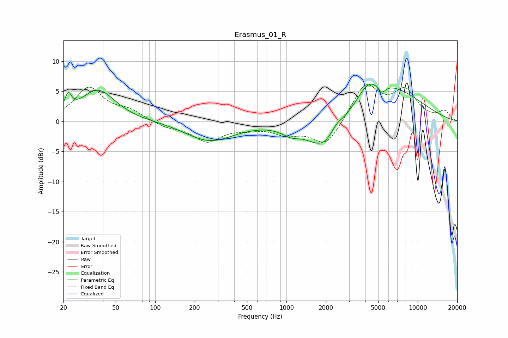

# Erasmus_01_R
See [usage instructions](https://github.com/jaakkopasanen/AutoEq#usage) for more options and info.

### Parametric EQs
Apply preamp of -6.3 dB when using parametric equalizer.

|   # | Type    |   Fc (Hz) |    Q |   Gain (dB) |
|-----|---------|-----------|------|-------------|
|   1 | Peaking |        22 | 5.84 |         2.7 |
|   2 | Peaking |        37 | 1.08 |         5.2 |
|   3 | Peaking |       114 | 1.96 |         0.1 |
|   4 | Peaking |       261 | 0.77 |        -3.2 |
|   5 | Peaking |      1083 | 1.97 |        -1.2 |
|   6 | Peaking |      1925 | 1.12 |        -5.1 |
|   7 | Peaking |      2400 | 3.49 |         1.1 |
|   8 | Peaking |      4202 | 1.72 |         2.8 |
|   9 | Peaking |      5324 | 4.96 |        -1.4 |
|  10 | Peaking |      6144 | 0.55 |         5.4 |

### Fixed Band EQs
When using fixed band (also called graphic) equalizer, apply preamp of **-6.2 dB** (if available) and set gains manually with these parameters.

|   # | Type    |   Fc (Hz) |    Q |   Gain (dB) |
|-----|---------|-----------|------|-------------|
|   1 | Peaking |        31 | 1.41 |         5.5 |
|   2 | Peaking |        62 | 1.41 |         1.5 |
|   3 | Peaking |       125 | 1.41 |        -0.9 |
|   4 | Peaking |       250 | 1.41 |        -3.2 |
|   5 | Peaking |       500 | 1.41 |        -0.8 |
|   6 | Peaking |      1000 | 1.41 |        -1.8 |
|   7 | Peaking |      2000 | 1.41 |        -4.2 |
|   8 | Peaking |      4000 | 1.41 |         6.1 |
|   9 | Peaking |      8000 | 1.41 |         4.7 |
|  10 | Peaking |     16000 | 1.41 |         1.6 |

### Graphs

