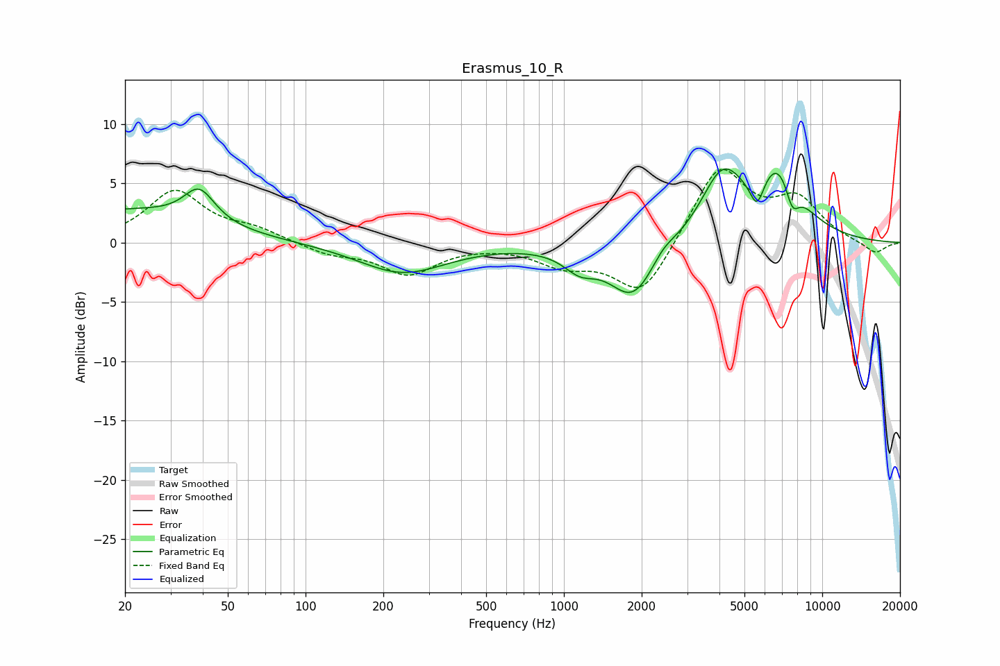

# Erasmus_10_R
See [usage instructions](https://github.com/jaakkopasanen/AutoEq#usage) for more options and info.

### Parametric EQs
Apply preamp of -6.3 dB when using parametric equalizer.

|   # | Type    |   Fc (Hz) |    Q |   Gain (dB) |
|-----|---------|-----------|------|-------------|
|   1 | Peaking |        20 | 0.48 |         2.6 |
|   2 | Peaking |        39 | 2.4  |         2.8 |
|   3 | Peaking |       237 | 0.84 |        -2.6 |
|   4 | Peaking |      1152 | 2.25 |        -1.5 |
|   5 | Peaking |      1853 | 1.53 |        -4.7 |
|   6 | Peaking |      2416 | 3.2  |         0.8 |
|   7 | Peaking |      4104 | 1.69 |         5.4 |
|   8 | Peaking |      5594 | 4.9  |        -2.6 |
|   9 | Peaking |      6790 | 1.48 |         6   |
|  10 | Peaking |      7653 | 4.77 |        -2.5 |

### Fixed Band EQs
When using fixed band (also called graphic) equalizer, apply preamp of **-6.3 dB** (if available) and set gains manually with these parameters.

|   # | Type    |   Fc (Hz) |    Q |   Gain (dB) |
|-----|---------|-----------|------|-------------|
|   1 | Peaking |        31 | 1.41 |         4.3 |
|   2 | Peaking |        62 | 1.41 |         1   |
|   3 | Peaking |       125 | 1.41 |        -0.9 |
|   4 | Peaking |       250 | 1.41 |        -2.6 |
|   5 | Peaking |       500 | 1.41 |        -0   |
|   6 | Peaking |      1000 | 1.41 |        -1.7 |
|   7 | Peaking |      2000 | 1.41 |        -4.6 |
|   8 | Peaking |      4000 | 1.41 |         6.5 |
|   9 | Peaking |      8000 | 1.41 |         3.3 |
|  10 | Peaking |     16000 | 1.41 |        -1   |

### Graphs

