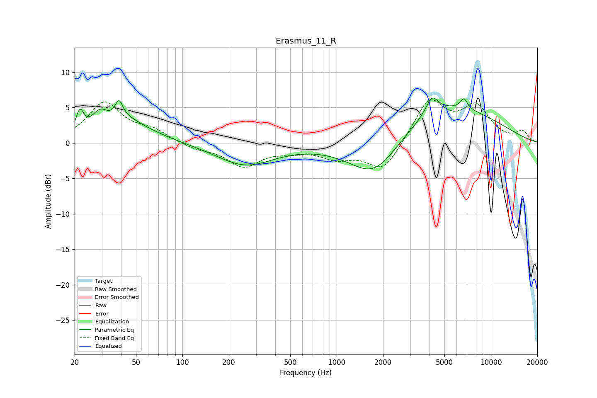

# Erasmus_11_R
See [usage instructions](https://github.com/jaakkopasanen/AutoEq#usage) for more options and info.

### Parametric EQs
Apply preamp of -6.4 dB when using parametric equalizer.

|   # | Type    |   Fc (Hz) |    Q |   Gain (dB) |
|-----|---------|-----------|------|-------------|
|   1 | Peaking |        22 | 5.8  |         3   |
|   2 | Peaking |        29 | 2.74 |         2.5 |
|   3 | Peaking |        39 | 5.68 |         2.6 |
|   4 | Peaking |        44 | 0.78 |         2.6 |
|   5 | Peaking |        46 | 2.42 |         0.4 |
|   6 | Peaking |       255 | 0.76 |        -3.1 |
|   7 | Peaking |      1770 | 0.83 |        -6.3 |
|   8 | Peaking |      4145 | 3.57 |         2.5 |
|   9 | Peaking |      4879 | 0.39 |         5.6 |
|  10 | Peaking |      6691 | 5.98 |         1.5 |

### Fixed Band EQs
When using fixed band (also called graphic) equalizer, apply preamp of **-6.2 dB** (if available) and set gains manually with these parameters.

|   # | Type    |   Fc (Hz) |    Q |   Gain (dB) |
|-----|---------|-----------|------|-------------|
|   1 | Peaking |        31 | 1.41 |         5.5 |
|   2 | Peaking |        62 | 1.41 |         1.6 |
|   3 | Peaking |       125 | 1.41 |        -0.8 |
|   4 | Peaking |       250 | 1.41 |        -3.2 |
|   5 | Peaking |       500 | 1.41 |        -0.8 |
|   6 | Peaking |      1000 | 1.41 |        -1.8 |
|   7 | Peaking |      2000 | 1.41 |        -4.1 |
|   8 | Peaking |      4000 | 1.41 |         6.1 |
|   9 | Peaking |      8000 | 1.41 |         4.8 |
|  10 | Peaking |     16000 | 1.41 |         1.5 |

### Graphs

