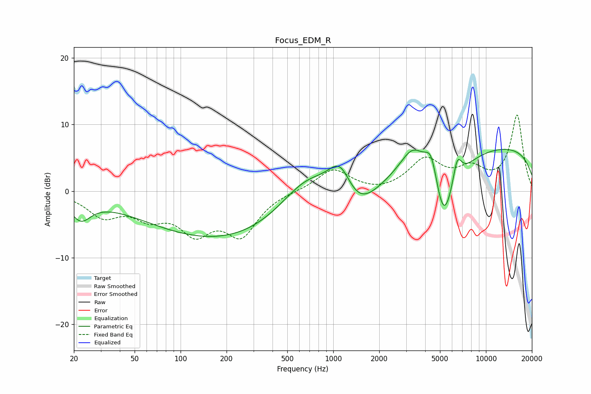

# Focus_EDM_R
See [usage instructions](https://github.com/jaakkopasanen/AutoEq#usage) for more options and info.

### Parametric EQs
Apply preamp of -6.4 dB when using parametric equalizer.

|   # | Type    |   Fc (Hz) |    Q |   Gain (dB) |
|-----|---------|-----------|------|-------------|
|   1 | Peaking |        22 | 2.12 |        -3.2 |
|   2 | Peaking |       206 | 0.25 |        -7.6 |
|   3 | Peaking |       666 | 0.77 |         6   |
|   4 | Peaking |      1114 | 1.69 |         6.3 |
|   5 | Peaking |      1390 | 0.99 |        -6   |
|   6 | Peaking |      3325 | 1.74 |         4.1 |
|   7 | Peaking |      4401 | 3.05 |         5.6 |
|   8 | Peaking |      5263 | 1.65 |       -12.1 |
|   9 | Peaking |      6478 | 4.46 |         4.2 |
|  10 | Peaking |     10000 | 0.18 |         6.9 |

### Fixed Band EQs
When using fixed band (also called graphic) equalizer, apply preamp of **-11.5 dB** (if available) and set gains manually with these parameters.

|   # | Type    |   Fc (Hz) |    Q |   Gain (dB) |
|-----|---------|-----------|------|-------------|
|   1 | Peaking |        31 | 1.41 |        -3.4 |
|   2 | Peaking |        62 | 1.41 |        -3.1 |
|   3 | Peaking |       125 | 1.41 |        -5.4 |
|   4 | Peaking |       250 | 1.41 |        -6.1 |
|   5 | Peaking |       500 | 1.41 |         0.1 |
|   6 | Peaking |      1000 | 1.41 |         3.3 |
|   7 | Peaking |      2000 | 1.41 |        -0.4 |
|   8 | Peaking |      4000 | 1.41 |         4.5 |
|   9 | Peaking |      8000 | 1.41 |         2.9 |
|  10 | Peaking |     16000 | 1.41 |        11.3 |

### Graphs

