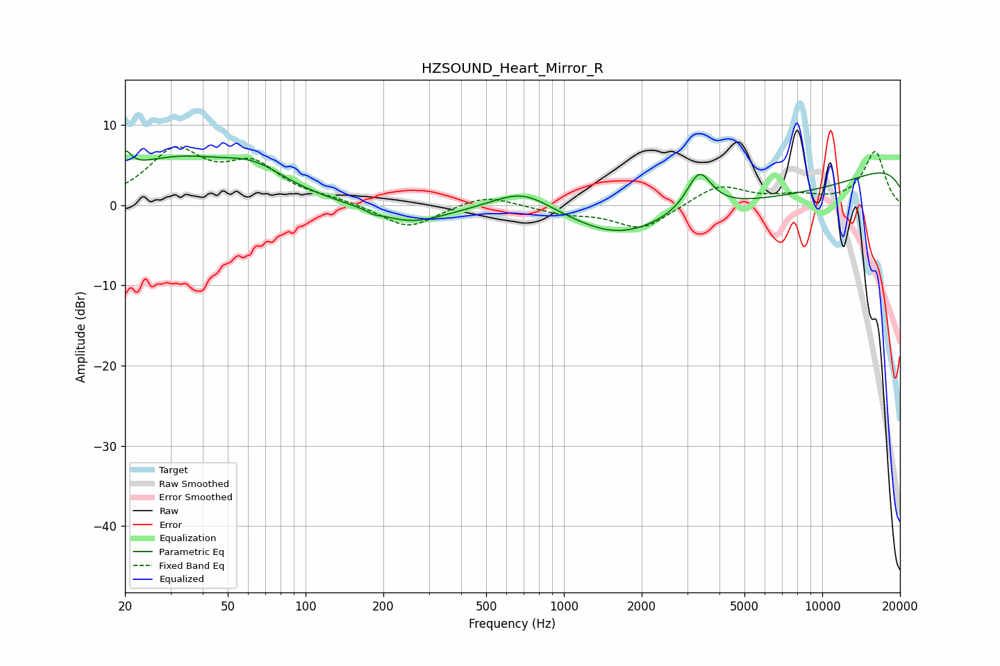

# HZSOUND_Heart_Mirror_R
See [usage instructions](https://github.com/jaakkopasanen/AutoEq#usage) for more options and info.

### Parametric EQs
Apply preamp of -6.9 dB when using parametric equalizer.

|   # | Type    |   Fc (Hz) |    Q |   Gain (dB) |
|-----|---------|-----------|------|-------------|
|   1 | Peaking |        20 | 6    |         2.4 |
|   2 | Peaking |        31 | 0.6  |         5.3 |
|   3 | Peaking |        63 | 1.12 |         2.8 |
|   4 | Peaking |       184 | 5.81 |        -0.3 |
|   5 | Peaking |       254 | 1.03 |        -2.3 |
|   6 | Peaking |       693 | 1.24 |         2.7 |
|   7 | Peaking |      1612 | 0.84 |        -2.7 |
|   8 | Peaking |      3341 | 2.9  |         5   |
|   9 | Peaking |      5502 | 0.24 |        -6.3 |
|  10 | Peaking |     10000 | 0.18 |         7.6 |

### Fixed Band EQs
When using fixed band (also called graphic) equalizer, apply preamp of **-7.4 dB** (if available) and set gains manually with these parameters.

|   # | Type    |   Fc (Hz) |    Q |   Gain (dB) |
|-----|---------|-----------|------|-------------|
|   1 | Peaking |        31 | 1.41 |         6.4 |
|   2 | Peaking |        62 | 1.41 |         4.6 |
|   3 | Peaking |       125 | 1.41 |         0.6 |
|   4 | Peaking |       250 | 1.41 |        -3   |
|   5 | Peaking |       500 | 1.41 |         1.5 |
|   6 | Peaking |      1000 | 1.41 |        -0.9 |
|   7 | Peaking |      2000 | 1.41 |        -3   |
|   8 | Peaking |      4000 | 1.41 |         2.6 |
|   9 | Peaking |      8000 | 1.41 |         1   |
|  10 | Peaking |     16000 | 1.41 |         6.7 |

### Graphs

