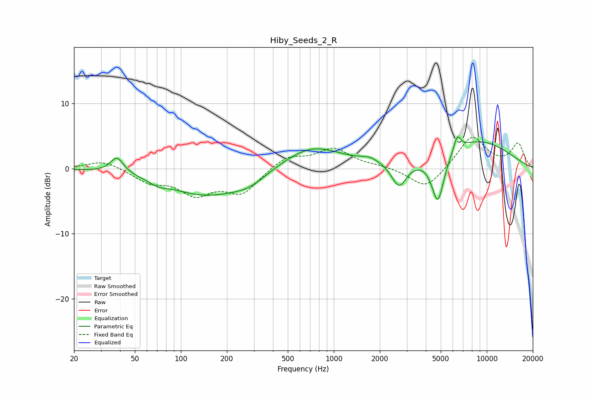

# Hiby_Seeds_2_R
See [usage instructions](https://github.com/jaakkopasanen/AutoEq#usage) for more options and info.

### Parametric EQs
Apply preamp of -5.0 dB when using parametric equalizer.

|   # | Type    |   Fc (Hz) |    Q |   Gain (dB) |
|-----|---------|-----------|------|-------------|
|   1 | Peaking |        38 | 3.36 |         2.4 |
|   2 | Peaking |        71 | 2.52 |        -0.7 |
|   3 | Peaking |       145 | 0.56 |        -4   |
|   4 | Peaking |       278 | 1.27 |        -1.4 |
|   5 | Peaking |       717 | 0.73 |         3.6 |
|   6 | Peaking |      1718 | 2.39 |         0.8 |
|   7 | Peaking |      2674 | 2.87 |        -3.9 |
|   8 | Peaking |      4790 | 3.39 |        -7.5 |
|   9 | Peaking |      6414 | 6    |         2.3 |
|  10 | Peaking |      8487 | 0.51 |         4.3 |

### Fixed Band EQs
When using fixed band (also called graphic) equalizer, apply preamp of **-4.9 dB** (if available) and set gains manually with these parameters.

|   # | Type    |   Fc (Hz) |    Q |   Gain (dB) |
|-----|---------|-----------|------|-------------|
|   1 | Peaking |        31 | 1.41 |         1.3 |
|   2 | Peaking |        62 | 1.41 |        -1.9 |
|   3 | Peaking |       125 | 1.41 |        -3.6 |
|   4 | Peaking |       250 | 1.41 |        -3.6 |
|   5 | Peaking |       500 | 1.41 |         1.9 |
|   6 | Peaking |      1000 | 1.41 |         2.9 |
|   7 | Peaking |      2000 | 1.41 |         0.3 |
|   8 | Peaking |      4000 | 1.41 |        -3.3 |
|   9 | Peaking |      8000 | 1.41 |         5   |
|  10 | Peaking |     16000 | 1.41 |         3.7 |

### Graphs

