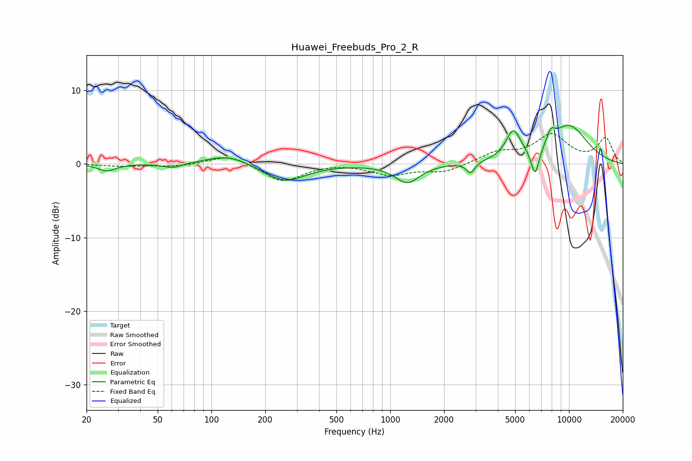

# Huawei_Freebuds_Pro_2_R
See [usage instructions](https://github.com/jaakkopasanen/AutoEq#usage) for more options and info.

### Parametric EQs
Apply preamp of -5.3 dB when using parametric equalizer.

|   # | Type    |   Fc (Hz) |    Q |   Gain (dB) |
|-----|---------|-----------|------|-------------|
|   1 | Peaking |        26 | 2.92 |        -0.9 |
|   2 | Peaking |        61 | 2.76 |        -0.6 |
|   3 | Peaking |       124 | 1.21 |         1.3 |
|   4 | Peaking |       258 | 1.23 |        -2.4 |
|   5 | Peaking |      1246 | 2.07 |        -2.5 |
|   6 | Peaking |      2815 | 6    |        -1.5 |
|   7 | Peaking |      4878 | 3.43 |         3.8 |
|   8 | Peaking |      6468 | 5.78 |        -4   |
|   9 | Peaking |      7929 | 5.99 |         1.4 |
|  10 | Peaking |      9941 | 1.05 |         5.2 |

### Fixed Band EQs
When using fixed band (also called graphic) equalizer, apply preamp of **-4.2 dB** (if available) and set gains manually with these parameters.

|   # | Type    |   Fc (Hz) |    Q |   Gain (dB) |
|-----|---------|-----------|------|-------------|
|   1 | Peaking |        31 | 1.41 |        -0.3 |
|   2 | Peaking |        62 | 1.41 |        -0.4 |
|   3 | Peaking |       125 | 1.41 |         1.3 |
|   4 | Peaking |       250 | 1.41 |        -2.4 |
|   5 | Peaking |       500 | 1.41 |         0.2 |
|   6 | Peaking |      1000 | 1.41 |        -1.4 |
|   7 | Peaking |      2000 | 1.41 |        -1.1 |
|   8 | Peaking |      4000 | 1.41 |         1.5 |
|   9 | Peaking |      8000 | 1.41 |         3.8 |
|  10 | Peaking |     16000 | 1.41 |         3.4 |

### Graphs

