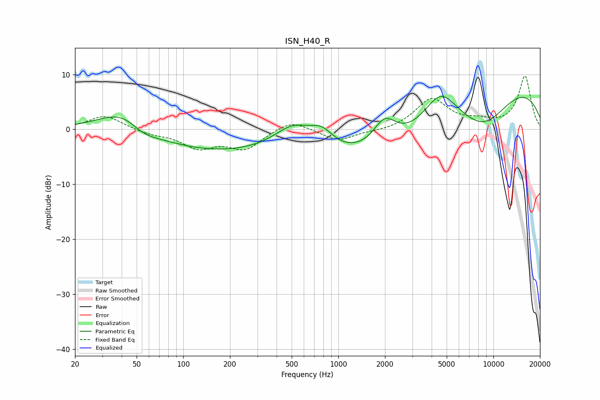

# ISN_H40_R
See [usage instructions](https://github.com/jaakkopasanen/AutoEq#usage) for more options and info.

### Parametric EQs
Apply preamp of -6.1 dB when using parametric equalizer.

|   # | Type    |   Fc (Hz) |    Q |   Gain (dB) |
|-----|---------|-----------|------|-------------|
|   1 | Peaking |        42 | 0.88 |         5.2 |
|   2 | Peaking |        54 | 1.37 |        -2.4 |
|   3 | Peaking |       154 | 0.32 |        -3.9 |
|   4 | Peaking |       512 | 1.13 |         4.3 |
|   5 | Peaking |       781 | 1.86 |         2.9 |
|   6 | Peaking |      1991 | 1.85 |         5.1 |
|   7 | Peaking |      2145 | 0.3  |        -7.1 |
|   8 | Peaking |      4562 | 1.24 |         6.7 |
|   9 | Peaking |      8758 | 0.67 |        -8.2 |
|  10 | Peaking |     10000 | 0.26 |        10.9 |

### Fixed Band EQs
When using fixed band (also called graphic) equalizer, apply preamp of **-9.8 dB** (if available) and set gains manually with these parameters.

|   # | Type    |   Fc (Hz) |    Q |   Gain (dB) |
|-----|---------|-----------|------|-------------|
|   1 | Peaking |        31 | 1.41 |         2.6 |
|   2 | Peaking |        62 | 1.41 |        -0.8 |
|   3 | Peaking |       125 | 1.41 |        -3.1 |
|   4 | Peaking |       250 | 1.41 |        -3.4 |
|   5 | Peaking |       500 | 1.41 |         1.9 |
|   6 | Peaking |      1000 | 1.41 |        -2.1 |
|   7 | Peaking |      2000 | 1.41 |        -0.4 |
|   8 | Peaking |      4000 | 1.41 |         5.5 |
|   9 | Peaking |      8000 | 1.41 |         1.1 |
|  10 | Peaking |     16000 | 1.41 |         9.6 |

### Graphs

