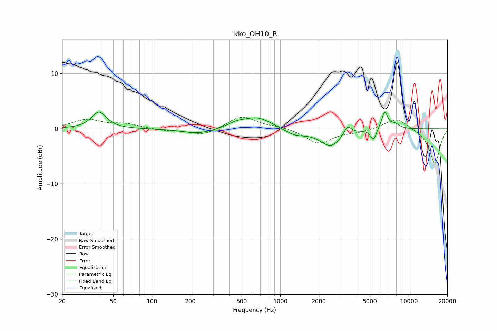

# Ikko_OH10_R
See [usage instructions](https://github.com/jaakkopasanen/AutoEq#usage) for more options and info.

### Parametric EQs
Apply preamp of -3.1 dB when using parametric equalizer.

|   # | Type    |   Fc (Hz) |    Q |   Gain (dB) |
|-----|---------|-----------|------|-------------|
|   1 | Peaking |        39 | 2.54 |         3   |
|   2 | Peaking |       229 | 1.19 |        -1   |
|   3 | Peaking |       453 | 2.28 |         0.6 |
|   4 | Peaking |       659 | 1.22 |         2.1 |
|   5 | Peaking |      1299 | 1.7  |        -1.1 |
|   6 | Peaking |      2470 | 1.66 |        -3.1 |
|   7 | Peaking |      3344 | 4.9  |         1.7 |
|   8 | Peaking |      5331 | 6    |        -2.1 |
|   9 | Peaking |      6507 | 5.48 |         3.2 |
|  10 | Peaking |      7830 | 3.89 |         0.8 |

### Fixed Band EQs
When using fixed band (also called graphic) equalizer, apply preamp of **-2.2 dB** (if available) and set gains manually with these parameters.

|   # | Type    |   Fc (Hz) |    Q |   Gain (dB) |
|-----|---------|-----------|------|-------------|
|   1 | Peaking |        31 | 1.41 |         1.6 |
|   2 | Peaking |        62 | 1.41 |         0.8 |
|   3 | Peaking |       125 | 1.41 |        -0.3 |
|   4 | Peaking |       250 | 1.41 |        -1.2 |
|   5 | Peaking |       500 | 1.41 |         2.3 |
|   6 | Peaking |      1000 | 1.41 |         0.4 |
|   7 | Peaking |      2000 | 1.41 |        -2.7 |
|   8 | Peaking |      4000 | 1.41 |        -0.5 |
|   9 | Peaking |      8000 | 1.41 |         2.1 |
|  10 | Peaking |     16000 | 1.41 |        -6.4 |

### Graphs

