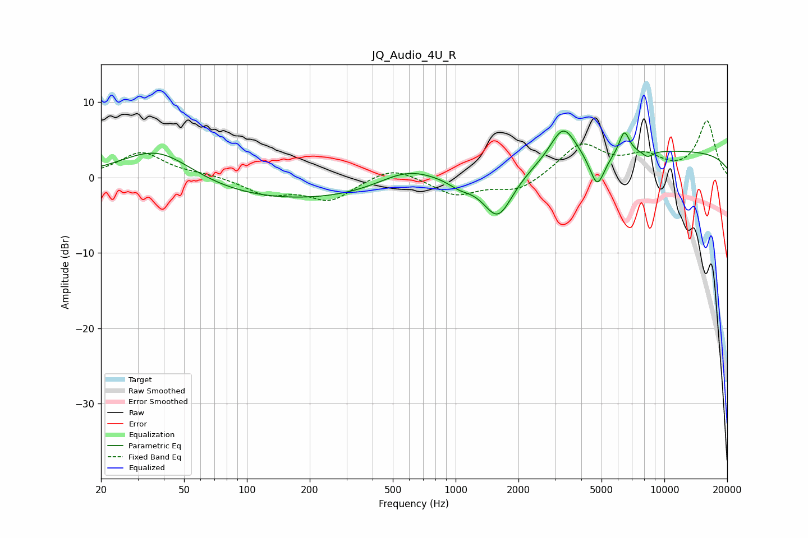

# JQ_Audio_4U_R
See [usage instructions](https://github.com/jaakkopasanen/AutoEq#usage) for more options and info.

### Parametric EQs
Apply preamp of -6.2 dB when using parametric equalizer.

|   # | Type    |   Fc (Hz) |    Q |   Gain (dB) |
|-----|---------|-----------|------|-------------|
|   1 | Peaking |        37 | 0.77 |         5.4 |
|   2 | Peaking |       133 | 0.22 |        -3.3 |
|   3 | Peaking |       584 | 1    |         2.4 |
|   4 | Peaking |      1048 | 2.55 |        -1   |
|   5 | Peaking |      1596 | 1.95 |        -6.1 |
|   6 | Peaking |      3274 | 2.31 |         4.7 |
|   7 | Peaking |      4767 | 3.74 |        -4.7 |
|   8 | Peaking |      6430 | 5.57 |         3.1 |
|   9 | Peaking |      8313 | 5.06 |        -0.8 |
|  10 | Peaking |     10000 | 0.18 |         3.5 |

### Fixed Band EQs
When using fixed band (also called graphic) equalizer, apply preamp of **-7.6 dB** (if available) and set gains manually with these parameters.

|   # | Type    |   Fc (Hz) |    Q |   Gain (dB) |
|-----|---------|-----------|------|-------------|
|   1 | Peaking |        31 | 1.41 |         3.3 |
|   2 | Peaking |        62 | 1.41 |         0.4 |
|   3 | Peaking |       125 | 1.41 |        -2.1 |
|   4 | Peaking |       250 | 1.41 |        -2.9 |
|   5 | Peaking |       500 | 1.41 |         1.6 |
|   6 | Peaking |      1000 | 1.41 |        -2.3 |
|   7 | Peaking |      2000 | 1.41 |        -1.9 |
|   8 | Peaking |      4000 | 1.41 |         4.4 |
|   9 | Peaking |      8000 | 1.41 |         2.4 |
|  10 | Peaking |     16000 | 1.41 |         7.4 |

### Graphs

