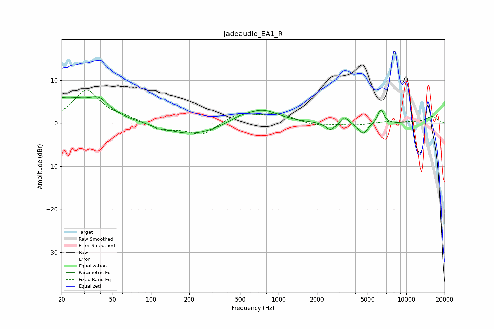

# Jadeaudio_EA1_R
See [usage instructions](https://github.com/jaakkopasanen/AutoEq#usage) for more options and info.

### Parametric EQs
Apply preamp of -6.2 dB when using parametric equalizer.

|   # | Type    |   Fc (Hz) |    Q |   Gain (dB) |
|-----|---------|-----------|------|-------------|
|   1 | Peaking |        21 | 0.59 |         5.8 |
|   2 | Peaking |        39 | 2.07 |         2.6 |
|   3 | Peaking |       112 | 6    |        -0.4 |
|   4 | Peaking |       207 | 0.65 |        -2.8 |
|   5 | Peaking |       481 | 1.77 |         1   |
|   6 | Peaking |       738 | 1.09 |         3.2 |
|   7 | Peaking |      2557 | 3.63 |        -1.8 |
|   8 | Peaking |      3282 | 5.15 |         1.8 |
|   9 | Peaking |      4610 | 3.9  |        -2.6 |
|  10 | Peaking |      6320 | 5.47 |         3.3 |

### Fixed Band EQs
When using fixed band (also called graphic) equalizer, apply preamp of **-7.8 dB** (if available) and set gains manually with these parameters.

|   # | Type    |   Fc (Hz) |    Q |   Gain (dB) |
|-----|---------|-----------|------|-------------|
|   1 | Peaking |        31 | 1.41 |         7.6 |
|   2 | Peaking |        62 | 1.41 |         0.9 |
|   3 | Peaking |       125 | 1.41 |        -1.6 |
|   4 | Peaking |       250 | 1.41 |        -2.8 |
|   5 | Peaking |       500 | 1.41 |         2.4 |
|   6 | Peaking |      1000 | 1.41 |         2.1 |
|   7 | Peaking |      2000 | 1.41 |        -0.7 |
|   8 | Peaking |      4000 | 1.41 |        -0.5 |
|   9 | Peaking |      8000 | 1.41 |         0.5 |
|  10 | Peaking |     16000 | 1.41 |         1.6 |

### Graphs

