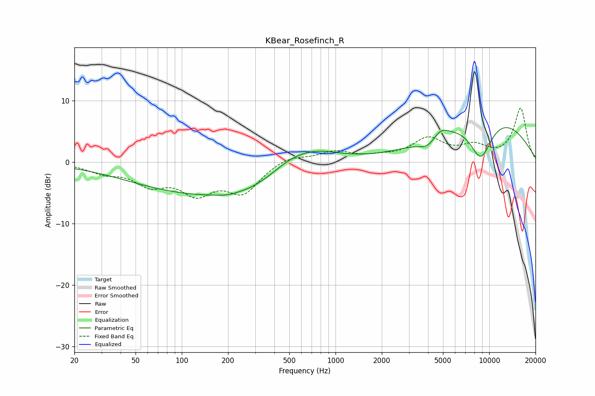

# KBear_Rosefinch_R
See [usage instructions](https://github.com/jaakkopasanen/AutoEq#usage) for more options and info.

### Parametric EQs
Apply preamp of -5.7 dB when using parametric equalizer.

|   # | Type    |   Fc (Hz) |    Q |   Gain (dB) |
|-----|---------|-----------|------|-------------|
|   1 | Peaking |       160 | 0.26 |        -5.4 |
|   2 | Peaking |       233 | 1.33 |        -1   |
|   3 | Peaking |       240 | 2.38 |         0.4 |
|   4 | Peaking |       498 | 1.12 |         1.6 |
|   5 | Peaking |       724 | 0.8  |         3   |
|   6 | Peaking |      3982 | 2.46 |        -1.6 |
|   7 | Peaking |      4811 | 2.69 |         1.4 |
|   8 | Peaking |      7656 | 0.5  |         1   |
|   9 | Peaking |      8813 | 1.66 |        -7.1 |
|  10 | Peaking |      9926 | 0.37 |         7.2 |

### Fixed Band EQs
When using fixed band (also called graphic) equalizer, apply preamp of **-8.9 dB** (if available) and set gains manually with these parameters.

|   # | Type    |   Fc (Hz) |    Q |   Gain (dB) |
|-----|---------|-----------|------|-------------|
|   1 | Peaking |        31 | 1.41 |        -1.4 |
|   2 | Peaking |        62 | 1.41 |        -3.2 |
|   3 | Peaking |       125 | 1.41 |        -4.5 |
|   4 | Peaking |       250 | 1.41 |        -4.6 |
|   5 | Peaking |       500 | 1.41 |         1.1 |
|   6 | Peaking |      1000 | 1.41 |         1.6 |
|   7 | Peaking |      2000 | 1.41 |         0.6 |
|   8 | Peaking |      4000 | 1.41 |         3.6 |
|   9 | Peaking |      8000 | 1.41 |         2.2 |
|  10 | Peaking |     16000 | 1.41 |         8.7 |

### Graphs

