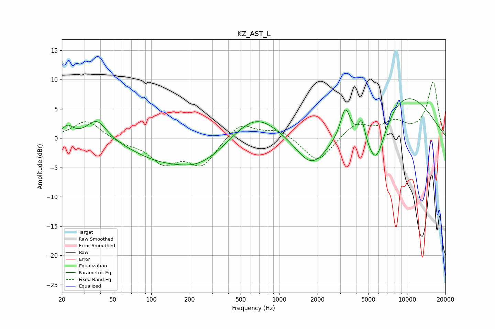

# KZ_AST_L
See [usage instructions](https://github.com/jaakkopasanen/AutoEq#usage) for more options and info.

### Parametric EQs
Apply preamp of -6.8 dB when using parametric equalizer.

|   # | Type    |   Fc (Hz) |    Q |   Gain (dB) |
|-----|---------|-----------|------|-------------|
|   1 | Peaking |        22 | 3.26 |         1.8 |
|   2 | Peaking |        38 | 1.83 |         3.5 |
|   3 | Peaking |       104 | 0.7  |        -2.2 |
|   4 | Peaking |       239 | 0.64 |        -4.5 |
|   5 | Peaking |       651 | 0.76 |         4.9 |
|   6 | Peaking |      1804 | 1.11 |        -5.7 |
|   7 | Peaking |      3290 | 3.84 |         5   |
|   8 | Peaking |      4435 | 6    |         3.1 |
|   9 | Peaking |      5719 | 1.72 |        -9   |
|  10 | Peaking |      9134 | 0.47 |         8.2 |

### Fixed Band EQs
When using fixed band (also called graphic) equalizer, apply preamp of **-9.7 dB** (if available) and set gains manually with these parameters.

|   # | Type    |   Fc (Hz) |    Q |   Gain (dB) |
|-----|---------|-----------|------|-------------|
|   1 | Peaking |        31 | 1.41 |         3.1 |
|   2 | Peaking |        62 | 1.41 |        -0.8 |
|   3 | Peaking |       125 | 1.41 |        -3.9 |
|   4 | Peaking |       250 | 1.41 |        -4.5 |
|   5 | Peaking |       500 | 1.41 |         2.8 |
|   6 | Peaking |      1000 | 1.41 |         1.5 |
|   7 | Peaking |      2000 | 1.41 |        -4.3 |
|   8 | Peaking |      4000 | 1.41 |         2.5 |
|   9 | Peaking |      8000 | 1.41 |         2.4 |
|  10 | Peaking |     16000 | 1.41 |         9.5 |

### Graphs

