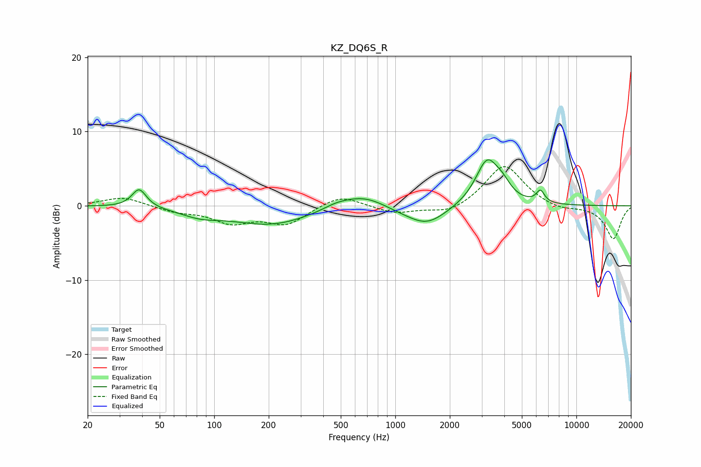

# KZ_DQ6S_R
See [usage instructions](https://github.com/jaakkopasanen/AutoEq#usage) for more options and info.

### Parametric EQs
Apply preamp of -6.3 dB when using parametric equalizer.

|   # | Type    |   Fc (Hz) |    Q |   Gain (dB) |
|-----|---------|-----------|------|-------------|
|   1 | Peaking |        38 | 3.61 |         2.5 |
|   2 | Peaking |        84 | 1.31 |        -1   |
|   3 | Peaking |       207 | 0.63 |        -2.5 |
|   4 | Peaking |       468 | 2.07 |         0.4 |
|   5 | Peaking |       663 | 1.04 |         2   |
|   6 | Peaking |      1041 | 1.1  |        -0.6 |
|   7 | Peaking |      1497 | 1.31 |        -2.5 |
|   8 | Peaking |      3215 | 2.19 |         6.1 |
|   9 | Peaking |      3919 | 3.2  |         1.4 |
|  10 | Peaking |      6329 | 6    |         1.6 |

### Fixed Band EQs
When using fixed band (also called graphic) equalizer, apply preamp of **-5.4 dB** (if available) and set gains manually with these parameters.

|   # | Type    |   Fc (Hz) |    Q |   Gain (dB) |
|-----|---------|-----------|------|-------------|
|   1 | Peaking |        31 | 1.41 |         1.2 |
|   2 | Peaking |        62 | 1.41 |        -0.7 |
|   3 | Peaking |       125 | 1.41 |        -2.1 |
|   4 | Peaking |       250 | 1.41 |        -2.4 |
|   5 | Peaking |       500 | 1.41 |         1.6 |
|   6 | Peaking |      1000 | 1.41 |        -1   |
|   7 | Peaking |      2000 | 1.41 |        -1.2 |
|   8 | Peaking |      4000 | 1.41 |         5.6 |
|   9 | Peaking |      8000 | 1.41 |        -0.6 |
|  10 | Peaking |     16000 | 1.41 |        -4.5 |

### Graphs

