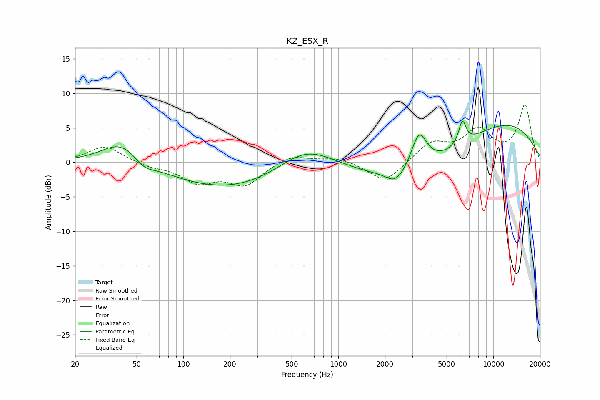

# KZ_ESX_R
See [usage instructions](https://github.com/jaakkopasanen/AutoEq#usage) for more options and info.

### Parametric EQs
Apply preamp of -6.1 dB when using parametric equalizer.

|   # | Type    |   Fc (Hz) |    Q |   Gain (dB) |
|-----|---------|-----------|------|-------------|
|   1 | Peaking |        40 | 1.09 |         3.5 |
|   2 | Peaking |        56 | 2.18 |        -1.3 |
|   3 | Peaking |       202 | 0.37 |        -3.9 |
|   4 | Peaking |       617 | 0.78 |         3.7 |
|   5 | Peaking |      2302 | 2.68 |        -1.2 |
|   6 | Peaking |      2570 | 1.99 |        -0.8 |
|   7 | Peaking |      3314 | 2.71 |         5.4 |
|   8 | Peaking |      3810 | 0.36 |        -4.2 |
|   9 | Peaking |      6313 | 5.75 |         3.3 |
|  10 | Peaking |     10000 | 0.34 |         7   |

### Fixed Band EQs
When using fixed band (also called graphic) equalizer, apply preamp of **-8.4 dB** (if available) and set gains manually with these parameters.

|   # | Type    |   Fc (Hz) |    Q |   Gain (dB) |
|-----|---------|-----------|------|-------------|
|   1 | Peaking |        31 | 1.41 |         2.4 |
|   2 | Peaking |        62 | 1.41 |        -0.6 |
|   3 | Peaking |       125 | 1.41 |        -2.7 |
|   4 | Peaking |       250 | 1.41 |        -3.1 |
|   5 | Peaking |       500 | 1.41 |         1.2 |
|   6 | Peaking |      1000 | 1.41 |         0.7 |
|   7 | Peaking |      2000 | 1.41 |        -3   |
|   8 | Peaking |      4000 | 1.41 |         2.7 |
|   9 | Peaking |      8000 | 1.41 |         4.3 |
|  10 | Peaking |     16000 | 1.41 |         8.2 |

### Graphs

