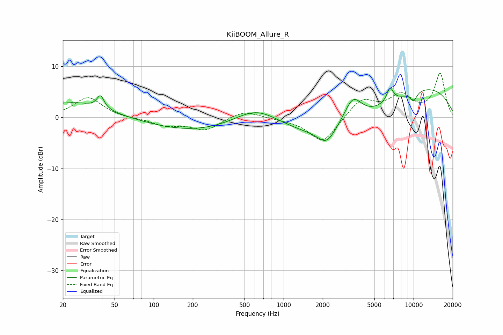

# KiiBOOM_Allure_R
See [usage instructions](https://github.com/jaakkopasanen/AutoEq#usage) for more options and info.

### Parametric EQs
Apply preamp of -5.8 dB when using parametric equalizer.

|   # | Type    |   Fc (Hz) |    Q |   Gain (dB) |
|-----|---------|-----------|------|-------------|
|   1 | Peaking |        24 | 0.56 |         3   |
|   2 | Peaking |        39 | 5.37 |         2.5 |
|   3 | Peaking |       211 | 0.4  |        -2.7 |
|   4 | Peaking |       617 | 0.83 |         3.5 |
|   5 | Peaking |      2140 | 2.17 |        -2.9 |
|   6 | Peaking |      3113 | 0.34 |        -6.2 |
|   7 | Peaking |      3404 | 1.97 |         5.3 |
|   8 | Peaking |      6590 | 5.39 |         2.8 |
|   9 | Peaking |      9370 | 0.27 |         7.4 |
|  10 | Peaking |     10000 | 4.48 |        -1.8 |

### Fixed Band EQs
When using fixed band (also called graphic) equalizer, apply preamp of **-8.8 dB** (if available) and set gains manually with these parameters.

|   # | Type    |   Fc (Hz) |    Q |   Gain (dB) |
|-----|---------|-----------|------|-------------|
|   1 | Peaking |        31 | 1.41 |         4   |
|   2 | Peaking |        62 | 1.41 |        -0.2 |
|   3 | Peaking |       125 | 1.41 |        -1.5 |
|   4 | Peaking |       250 | 1.41 |        -2.4 |
|   5 | Peaking |       500 | 1.41 |         1.5 |
|   6 | Peaking |      1000 | 1.41 |        -0.2 |
|   7 | Peaking |      2000 | 1.41 |        -5.1 |
|   8 | Peaking |      4000 | 1.41 |         3.6 |
|   9 | Peaking |      8000 | 1.41 |         4   |
|  10 | Peaking |     16000 | 1.41 |         8.5 |

### Graphs

