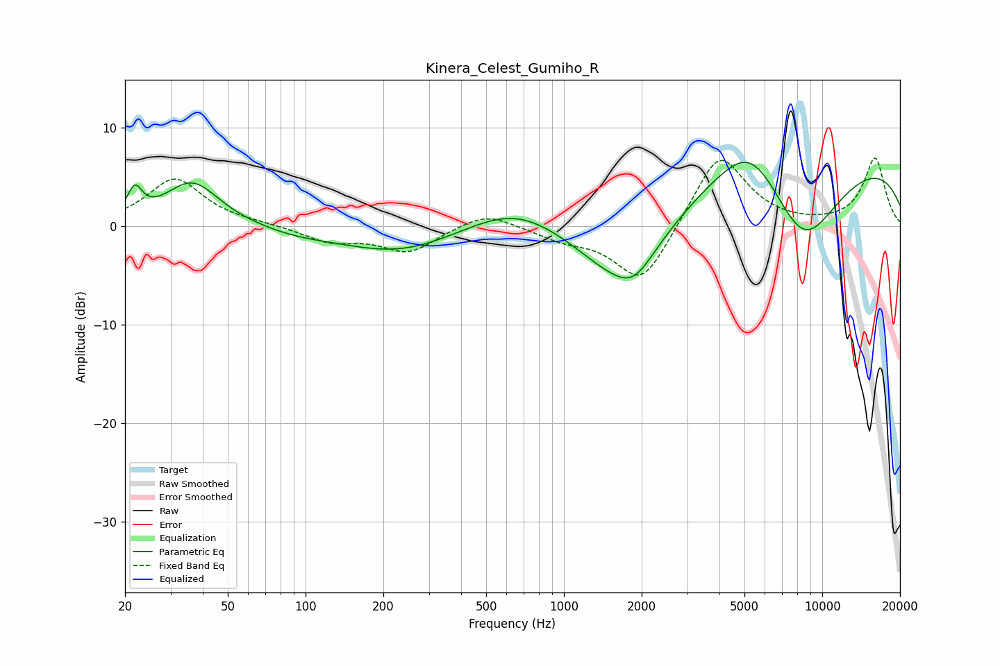

# Kinera_Celest_Gumiho_R
See [usage instructions](https://github.com/jaakkopasanen/AutoEq#usage) for more options and info.

### Parametric EQs
Apply preamp of -6.6 dB when using parametric equalizer.

|   # | Type    |   Fc (Hz) |    Q |   Gain (dB) |
|-----|---------|-----------|------|-------------|
|   1 | Peaking |        22 | 5.13 |         2.8 |
|   2 | Peaking |        36 | 1.35 |         4.5 |
|   3 | Peaking |        92 | 1    |        -0.6 |
|   4 | Peaking |       232 | 0.62 |        -2.7 |
|   5 | Peaking |       658 | 0.75 |         2.9 |
|   6 | Peaking |      1684 | 0.75 |        -7.5 |
|   7 | Peaking |      1871 | 1.99 |        -1.9 |
|   8 | Peaking |      5289 | 1.06 |         5.6 |
|   9 | Peaking |      8398 | 0.85 |        -9.7 |
|  10 | Peaking |      9347 | 0.19 |         7.7 |

### Fixed Band EQs
When using fixed band (also called graphic) equalizer, apply preamp of **-7.0 dB** (if available) and set gains manually with these parameters.

|   # | Type    |   Fc (Hz) |    Q |   Gain (dB) |
|-----|---------|-----------|------|-------------|
|   1 | Peaking |        31 | 1.41 |         4.8 |
|   2 | Peaking |        62 | 1.41 |         0.2 |
|   3 | Peaking |       125 | 1.41 |        -1.5 |
|   4 | Peaking |       250 | 1.41 |        -2.6 |
|   5 | Peaking |       500 | 1.41 |         1.6 |
|   6 | Peaking |      1000 | 1.41 |        -1.1 |
|   7 | Peaking |      2000 | 1.41 |        -6.1 |
|   8 | Peaking |      4000 | 1.41 |         7.7 |
|   9 | Peaking |      8000 | 1.41 |        -0   |
|  10 | Peaking |     16000 | 1.41 |         6.9 |

### Graphs

