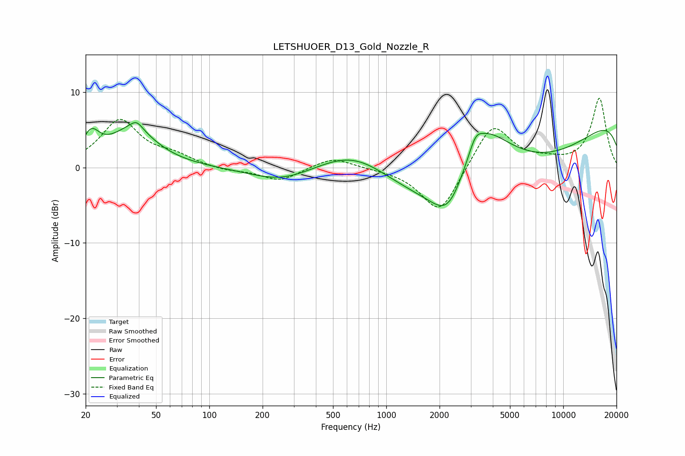

# LETSHUOER_D13_Gold_Nozzle_R
See [usage instructions](https://github.com/jaakkopasanen/AutoEq#usage) for more options and info.

### Parametric EQs
Apply preamp of -6.0 dB when using parametric equalizer.

|   # | Type    |   Fc (Hz) |    Q |   Gain (dB) |
|-----|---------|-----------|------|-------------|
|   1 | Peaking |        21 | 3.05 |         3.1 |
|   2 | Peaking |        37 | 1.07 |         4.8 |
|   3 | Peaking |        39 | 4.29 |         1   |
|   4 | Peaking |       259 | 0.77 |        -2   |
|   5 | Peaking |       683 | 0.61 |         5.6 |
|   6 | Peaking |      2258 | 1.37 |        -6.3 |
|   7 | Peaking |      3194 | 4.11 |         1.6 |
|   8 | Peaking |      3451 | 0.8  |        10.3 |
|   9 | Peaking |      3708 | 0.2  |       -12.2 |
|  10 | Peaking |     10000 | 0.18 |         9.8 |

### Fixed Band EQs
When using fixed band (also called graphic) equalizer, apply preamp of **-9.3 dB** (if available) and set gains manually with these parameters.

|   # | Type    |   Fc (Hz) |    Q |   Gain (dB) |
|-----|---------|-----------|------|-------------|
|   1 | Peaking |        31 | 1.41 |         6.2 |
|   2 | Peaking |        62 | 1.41 |         1.3 |
|   3 | Peaking |       125 | 1.41 |        -0.5 |
|   4 | Peaking |       250 | 1.41 |        -1.8 |
|   5 | Peaking |       500 | 1.41 |         1.4 |
|   6 | Peaking |      1000 | 1.41 |        -0.1 |
|   7 | Peaking |      2000 | 1.41 |        -6.3 |
|   8 | Peaking |      4000 | 1.41 |         6   |
|   9 | Peaking |      8000 | 1.41 |         0.6 |
|  10 | Peaking |     16000 | 1.41 |         9.1 |

### Graphs

