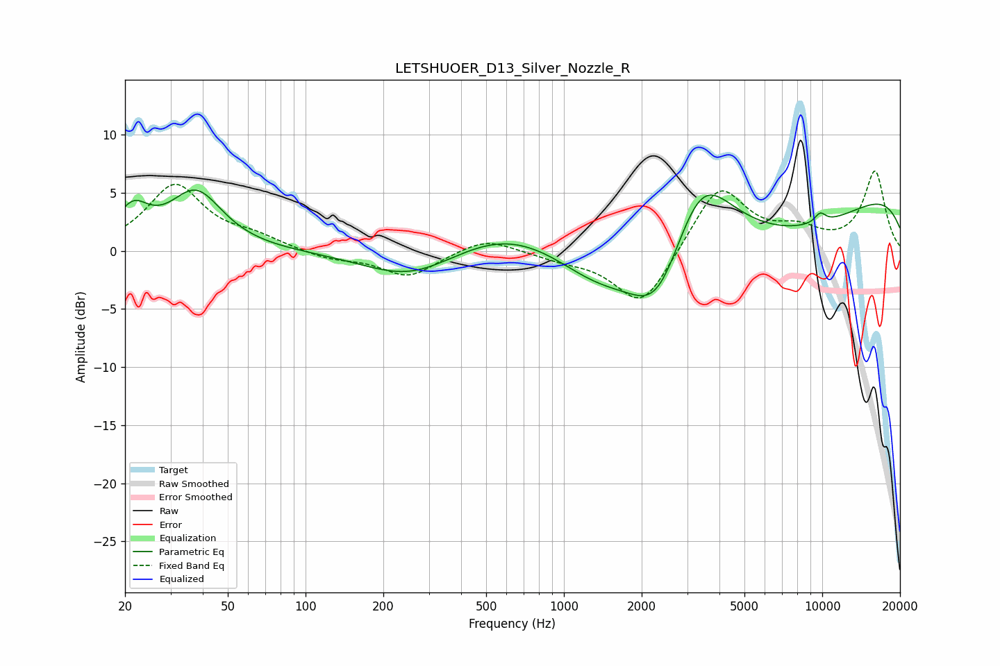

# LETSHUOER_D13_Silver_Nozzle_R
See [usage instructions](https://github.com/jaakkopasanen/AutoEq#usage) for more options and info.

### Parametric EQs
Apply preamp of -5.3 dB when using parametric equalizer.

|   # | Type    |   Fc (Hz) |    Q |   Gain (dB) |
|-----|---------|-----------|------|-------------|
|   1 | Peaking |        21 | 2.3  |         3   |
|   2 | Peaking |        38 | 1.4  |         4.9 |
|   3 | Peaking |       255 | 0.78 |        -2.5 |
|   4 | Peaking |       605 | 0.64 |         2.2 |
|   5 | Peaking |      1352 | 0.85 |        -2.9 |
|   6 | Peaking |      2308 | 1.23 |        -6.8 |
|   7 | Peaking |      3367 | 1.14 |         7.5 |
|   8 | Peaking |      6908 | 0.32 |        -6.8 |
|   9 | Peaking |      9555 | 0.2  |         8.3 |
|  10 | Peaking |      9823 | 5.58 |         0.9 |

### Fixed Band EQs
When using fixed band (also called graphic) equalizer, apply preamp of **-7.0 dB** (if available) and set gains manually with these parameters.

|   # | Type    |   Fc (Hz) |    Q |   Gain (dB) |
|-----|---------|-----------|------|-------------|
|   1 | Peaking |        31 | 1.41 |         5.6 |
|   2 | Peaking |        62 | 1.41 |         1   |
|   3 | Peaking |       125 | 1.41 |        -0.7 |
|   4 | Peaking |       250 | 1.41 |        -2.2 |
|   5 | Peaking |       500 | 1.41 |         1.3 |
|   6 | Peaking |      1000 | 1.41 |        -0.6 |
|   7 | Peaking |      2000 | 1.41 |        -5   |
|   8 | Peaking |      4000 | 1.41 |         5.7 |
|   9 | Peaking |      8000 | 1.41 |         1.5 |
|  10 | Peaking |     16000 | 1.41 |         6.8 |

### Graphs

