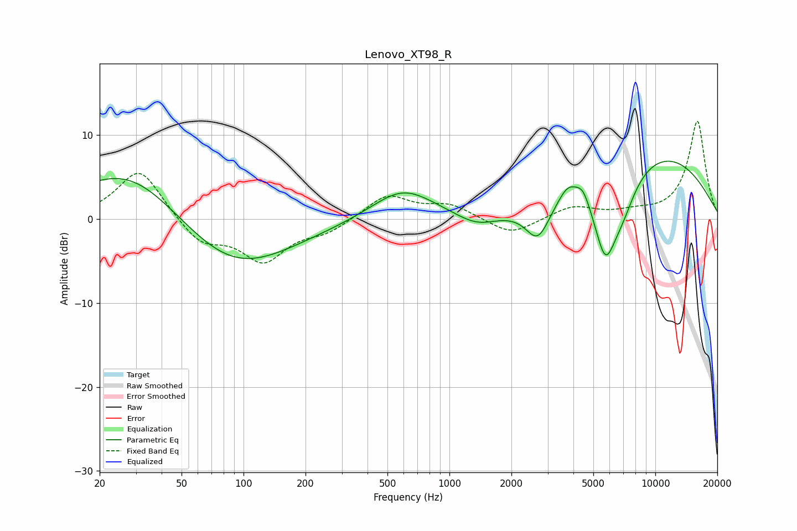

# Lenovo_XT98_R
See [usage instructions](https://github.com/jaakkopasanen/AutoEq#usage) for more options and info.

### Parametric EQs
Apply preamp of -7.0 dB when using parametric equalizer.

|   # | Type    |   Fc (Hz) |    Q |   Gain (dB) |
|-----|---------|-----------|------|-------------|
|   1 | Peaking |        28 | 0.54 |         6.8 |
|   2 | Peaking |        88 | 0.5  |        -6.7 |
|   3 | Peaking |       594 | 0.94 |         3.7 |
|   4 | Peaking |      1360 | 1.39 |        -1.6 |
|   5 | Peaking |      2686 | 2.43 |        -4.1 |
|   6 | Peaking |      3778 | 2.78 |         2.3 |
|   7 | Peaking |      4456 | 4.26 |         1.7 |
|   8 | Peaking |      5714 | 2.53 |        -8.2 |
|   9 | Peaking |      6890 | 1.9  |        -3.9 |
|  10 | Peaking |     10000 | 0.37 |         7.9 |

### Fixed Band EQs
When using fixed band (also called graphic) equalizer, apply preamp of **-11.7 dB** (if available) and set gains manually with these parameters.

|   # | Type    |   Fc (Hz) |    Q |   Gain (dB) |
|-----|---------|-----------|------|-------------|
|   1 | Peaking |        31 | 1.41 |         6.1 |
|   2 | Peaking |        62 | 1.41 |        -2.9 |
|   3 | Peaking |       125 | 1.41 |        -4.8 |
|   4 | Peaking |       250 | 1.41 |        -1.4 |
|   5 | Peaking |       500 | 1.41 |         2.9 |
|   6 | Peaking |      1000 | 1.41 |         1.6 |
|   7 | Peaking |      2000 | 1.41 |        -2   |
|   8 | Peaking |      4000 | 1.41 |         1.5 |
|   9 | Peaking |      8000 | 1.41 |         0.6 |
|  10 | Peaking |     16000 | 1.41 |        11.7 |

### Graphs

