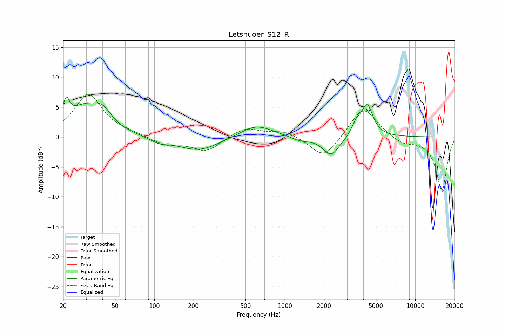

# Letshuoer_S12_R
See [usage instructions](https://github.com/jaakkopasanen/AutoEq#usage) for more options and info.

### Parametric EQs
Apply preamp of -6.8 dB when using parametric equalizer.

|   # | Type    |   Fc (Hz) |    Q |   Gain (dB) |
|-----|---------|-----------|------|-------------|
|   1 | Peaking |        21 | 5.84 |         3.3 |
|   2 | Peaking |        29 | 1.03 |         4.8 |
|   3 | Peaking |        40 | 2.21 |         2.1 |
|   4 | Peaking |       109 | 2.03 |        -0.8 |
|   5 | Peaking |       218 | 0.9  |        -2.3 |
|   6 | Peaking |       605 | 1.14 |         2.1 |
|   7 | Peaking |      1312 | 2.12 |        -0.7 |
|   8 | Peaking |      2270 | 2.2  |        -3.2 |
|   9 | Peaking |      3532 | 4.25 |         1.7 |
|  10 | Peaking |      4277 | 3.16 |         5.3 |

### Fixed Band EQs
When using fixed band (also called graphic) equalizer, apply preamp of **-7.2 dB** (if available) and set gains manually with these parameters.

|   # | Type    |   Fc (Hz) |    Q |   Gain (dB) |
|-----|---------|-----------|------|-------------|
|   1 | Peaking |        31 | 1.41 |         7.1 |
|   2 | Peaking |        62 | 1.41 |         0.4 |
|   3 | Peaking |       125 | 1.41 |        -1.4 |
|   4 | Peaking |       250 | 1.41 |        -2.3 |
|   5 | Peaking |       500 | 1.41 |         1.6 |
|   6 | Peaking |      1000 | 1.41 |         1   |
|   7 | Peaking |      2000 | 1.41 |        -3.7 |
|   8 | Peaking |      4000 | 1.41 |         5.2 |
|   9 | Peaking |      8000 | 1.41 |        -1.1 |
|  10 | Peaking |     16000 | 1.41 |        -9   |

### Graphs

