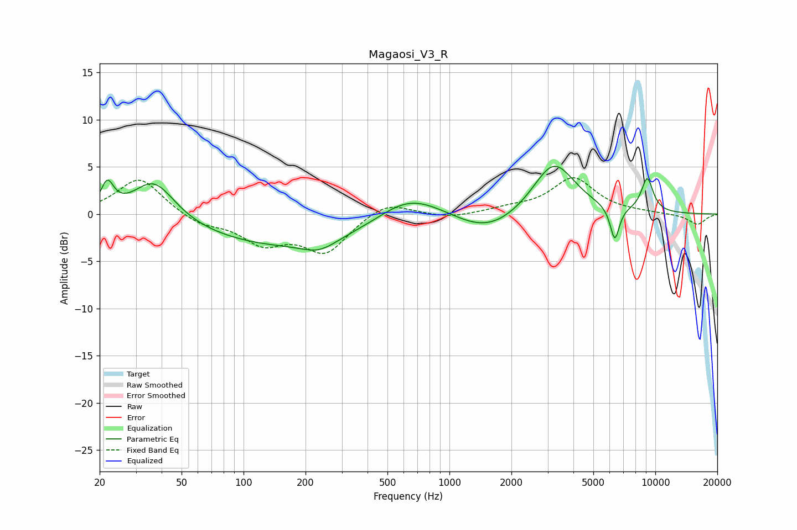

# Magaosi_V3_R
See [usage instructions](https://github.com/jaakkopasanen/AutoEq#usage) for more options and info.

### Parametric EQs
Apply preamp of -5.2 dB when using parametric equalizer.

|   # | Type    |   Fc (Hz) |    Q |   Gain (dB) |
|-----|---------|-----------|------|-------------|
|   1 | Peaking |        22 | 4.64 |         2.8 |
|   2 | Peaking |        37 | 1.4  |         4.3 |
|   3 | Peaking |       160 | 0.32 |        -3.4 |
|   4 | Peaking |       233 | 1.71 |        -1.1 |
|   5 | Peaking |       597 | 1.1  |         0.9 |
|   6 | Peaking |       679 | 0.8  |         2.2 |
|   7 | Peaking |      1532 | 0.85 |        -2.4 |
|   8 | Peaking |      3211 | 1.36 |         5.8 |
|   9 | Peaking |      6356 | 6    |        -3.6 |
|  10 | Peaking |      9136 | 4.29 |         3.6 |

### Fixed Band EQs
When using fixed band (also called graphic) equalizer, apply preamp of **-3.9 dB** (if available) and set gains manually with these parameters.

|   # | Type    |   Fc (Hz) |    Q |   Gain (dB) |
|-----|---------|-----------|------|-------------|
|   1 | Peaking |        31 | 1.41 |         3.9 |
|   2 | Peaking |        62 | 1.41 |        -1.1 |
|   3 | Peaking |       125 | 1.41 |        -2.8 |
|   4 | Peaking |       250 | 1.41 |        -3.9 |
|   5 | Peaking |       500 | 1.41 |         1.5 |
|   6 | Peaking |      1000 | 1.41 |        -0.5 |
|   7 | Peaking |      2000 | 1.41 |         0.5 |
|   8 | Peaking |      4000 | 1.41 |         3.8 |
|   9 | Peaking |      8000 | 1.41 |         0.1 |
|  10 | Peaking |     16000 | 1.41 |        -1.1 |

### Graphs

