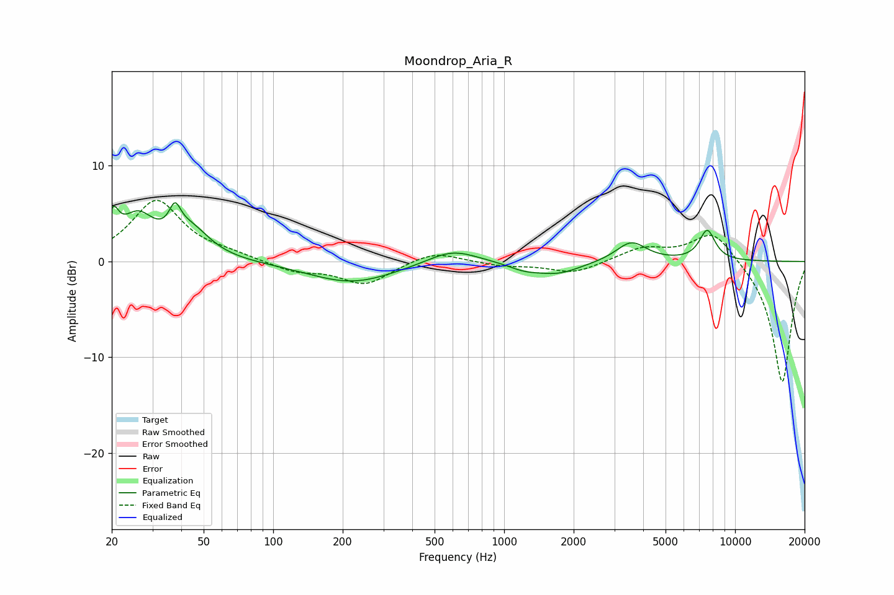

# Moondrop_Aria_R
See [usage instructions](https://github.com/jaakkopasanen/AutoEq#usage) for more options and info.

### Parametric EQs
Apply preamp of -6.2 dB when using parametric equalizer.

|   # | Type    |   Fc (Hz) |    Q |   Gain (dB) |
|-----|---------|-----------|------|-------------|
|   1 | Peaking |        20 | 5.8  |         3.2 |
|   2 | Peaking |        26 | 1.96 |         4.2 |
|   3 | Peaking |        38 | 5.82 |         2.5 |
|   4 | Peaking |        44 | 1.69 |         3   |
|   5 | Peaking |       219 | 0.75 |        -2.2 |
|   6 | Peaking |       596 | 1.31 |         1.5 |
|   7 | Peaking |      1217 | 2.06 |        -0.6 |
|   8 | Peaking |      1704 | 1.39 |        -1.3 |
|   9 | Peaking |      3553 | 2.14 |         2.1 |
|  10 | Peaking |      7577 | 3.87 |         3.2 |

### Fixed Band EQs
When using fixed band (also called graphic) equalizer, apply preamp of **-6.5 dB** (if available) and set gains manually with these parameters.

|   # | Type    |   Fc (Hz) |    Q |   Gain (dB) |
|-----|---------|-----------|------|-------------|
|   1 | Peaking |        31 | 1.41 |         6.3 |
|   2 | Peaking |        62 | 1.41 |         0.6 |
|   3 | Peaking |       125 | 1.41 |        -1   |
|   4 | Peaking |       250 | 1.41 |        -2.4 |
|   5 | Peaking |       500 | 1.41 |         1.2 |
|   6 | Peaking |      1000 | 1.41 |        -0.4 |
|   7 | Peaking |      2000 | 1.41 |        -1.2 |
|   8 | Peaking |      4000 | 1.41 |         1.4 |
|   9 | Peaking |      8000 | 1.41 |         3.3 |
|  10 | Peaking |     16000 | 1.41 |       -12.8 |

### Graphs

