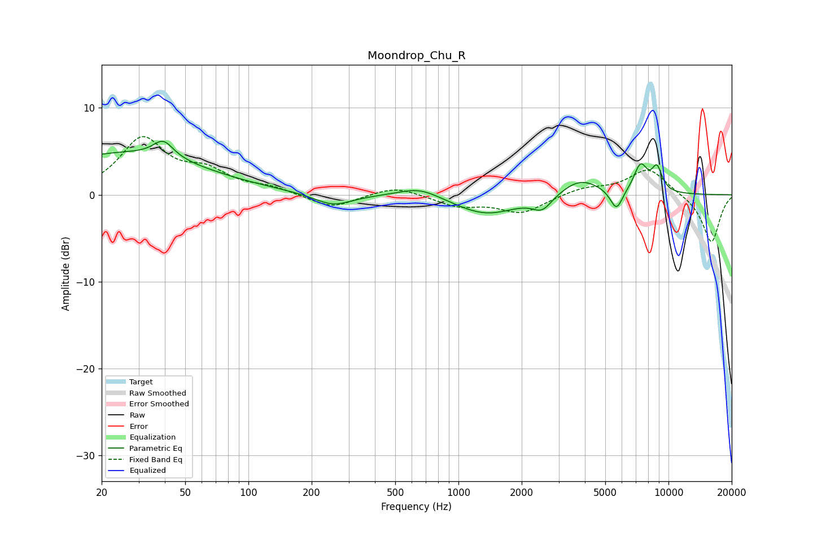

# Moondrop_Chu_R
See [usage instructions](https://github.com/jaakkopasanen/AutoEq#usage) for more options and info.

### Parametric EQs
Apply preamp of -6.2 dB when using parametric equalizer.

|   # | Type    |   Fc (Hz) |    Q |   Gain (dB) |
|-----|---------|-----------|------|-------------|
|   1 | Peaking |        25 | 0.37 |         4.7 |
|   2 | Peaking |        39 | 2.99 |         1.9 |
|   3 | Peaking |       253 | 1.53 |        -1.4 |
|   4 | Peaking |       654 | 1.42 |         1.2 |
|   5 | Peaking |      1355 | 0.93 |        -2.3 |
|   6 | Peaking |      2508 | 3.07 |        -1.6 |
|   7 | Peaking |      3804 | 1.47 |         2   |
|   8 | Peaking |      5652 | 4.65 |        -2.4 |
|   9 | Peaking |      7364 | 4.09 |         3.2 |
|  10 | Peaking |      8813 | 5.06 |         2.7 |

### Fixed Band EQs
When using fixed band (also called graphic) equalizer, apply preamp of **-6.8 dB** (if available) and set gains manually with these parameters.

|   # | Type    |   Fc (Hz) |    Q |   Gain (dB) |
|-----|---------|-----------|------|-------------|
|   1 | Peaking |        31 | 1.41 |         6.3 |
|   2 | Peaking |        62 | 1.41 |         2.3 |
|   3 | Peaking |       125 | 1.41 |         0.7 |
|   4 | Peaking |       250 | 1.41 |        -1.6 |
|   5 | Peaking |       500 | 1.41 |         1.1 |
|   6 | Peaking |      1000 | 1.41 |        -1.2 |
|   7 | Peaking |      2000 | 1.41 |        -2   |
|   8 | Peaking |      4000 | 1.41 |         0.8 |
|   9 | Peaking |      8000 | 1.41 |         3   |
|  10 | Peaking |     16000 | 1.41 |        -5.6 |

### Graphs

