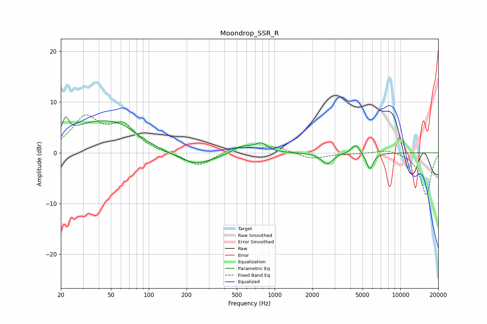

# Moondrop_SSR_R
See [usage instructions](https://github.com/jaakkopasanen/AutoEq#usage) for more options and info.

### Parametric EQs
Apply preamp of -7.2 dB when using parametric equalizer.

|   # | Type    |   Fc (Hz) |    Q |   Gain (dB) |
|-----|---------|-----------|------|-------------|
|   1 | Peaking |        22 | 5.77 |         3.2 |
|   2 | Peaking |        38 | 0.59 |         5.6 |
|   3 | Peaking |        63 | 1.22 |         1.6 |
|   4 | Peaking |       236 | 1.44 |        -0.8 |
|   5 | Peaking |       237 | 0.79 |        -1.9 |
|   6 | Peaking |       560 | 1.63 |         1.6 |
|   7 | Peaking |       789 | 3.12 |         1.5 |
|   8 | Peaking |      2612 | 3.17 |        -2.2 |
|   9 | Peaking |      4405 | 4.22 |         1.9 |
|  10 | Peaking |      5710 | 4.96 |        -3.3 |

### Fixed Band EQs
When using fixed band (also called graphic) equalizer, apply preamp of **-7.6 dB** (if available) and set gains manually with these parameters.

|   # | Type    |   Fc (Hz) |    Q |   Gain (dB) |
|-----|---------|-----------|------|-------------|
|   1 | Peaking |        31 | 1.41 |         6.6 |
|   2 | Peaking |        62 | 1.41 |         4.9 |
|   3 | Peaking |       125 | 1.41 |        -0.1 |
|   4 | Peaking |       250 | 1.41 |        -2.8 |
|   5 | Peaking |       500 | 1.41 |         1.3 |
|   6 | Peaking |      1000 | 1.41 |         1.2 |
|   7 | Peaking |      2000 | 1.41 |        -1.2 |
|   8 | Peaking |      4000 | 1.41 |        -0.1 |
|   9 | Peaking |      8000 | 1.41 |         0.8 |
|  10 | Peaking |     16000 | 1.41 |        -8.3 |

### Graphs

