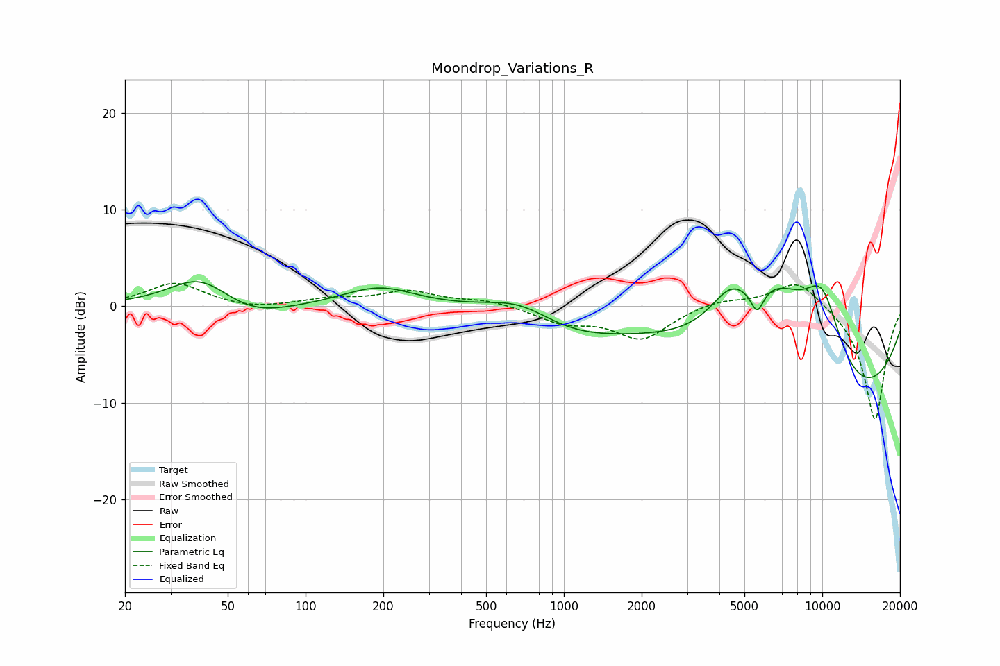

# Moondrop_Variations_R
See [usage instructions](https://github.com/jaakkopasanen/AutoEq#usage) for more options and info.

### Parametric EQs
Apply preamp of -2.6 dB when using parametric equalizer.

|   # | Type    |   Fc (Hz) |    Q |   Gain (dB) |
|-----|---------|-----------|------|-------------|
|   1 | Peaking |        39 | 1.17 |         3.3 |
|   2 | Peaking |        61 | 1    |        -1.6 |
|   3 | Peaking |       193 | 1.02 |         2   |
|   4 | Peaking |       685 | 1.01 |         2.4 |
|   5 | Peaking |      1002 | 0.66 |        -2.6 |
|   6 | Peaking |      4400 | 1.75 |         3.6 |
|   7 | Peaking |      5601 | 5.48 |        -2.5 |
|   8 | Peaking |      6741 | 0.73 |        11   |
|   9 | Peaking |      9975 | 0.34 |       -16.8 |
|  10 | Peaking |     10000 | 1.25 |        11.6 |

### Fixed Band EQs
When using fixed band (also called graphic) equalizer, apply preamp of **-2.5 dB** (if available) and set gains manually with these parameters.

|   # | Type    |   Fc (Hz) |    Q |   Gain (dB) |
|-----|---------|-----------|------|-------------|
|   1 | Peaking |        31 | 1.41 |         2.4 |
|   2 | Peaking |        62 | 1.41 |        -0.4 |
|   3 | Peaking |       125 | 1.41 |         0.7 |
|   4 | Peaking |       250 | 1.41 |         1.5 |
|   5 | Peaking |       500 | 1.41 |         0.6 |
|   6 | Peaking |      1000 | 1.41 |        -1.5 |
|   7 | Peaking |      2000 | 1.41 |        -3.3 |
|   8 | Peaking |      4000 | 1.41 |         0.7 |
|   9 | Peaking |      8000 | 1.41 |         2.9 |
|  10 | Peaking |     16000 | 1.41 |       -11.9 |

### Graphs

