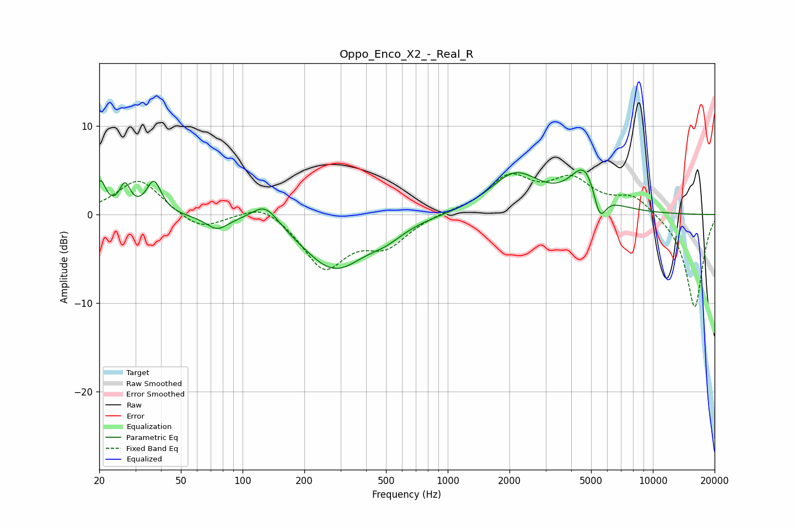

# Oppo_Enco_X2_-_Real_R
See [usage instructions](https://github.com/jaakkopasanen/AutoEq#usage) for more options and info.

### Parametric EQs
Apply preamp of -5.1 dB when using parametric equalizer.

|   # | Type    |   Fc (Hz) |    Q |   Gain (dB) |
|-----|---------|-----------|------|-------------|
|   1 | Peaking |        20 | 5.5  |         3.4 |
|   2 | Peaking |        27 | 5.46 |         2.9 |
|   3 | Peaking |        37 | 3.98 |         3.6 |
|   4 | Peaking |        75 | 2.68 |        -1.5 |
|   5 | Peaking |       129 | 2.11 |         2.5 |
|   6 | Peaking |       280 | 0.92 |        -6.1 |
|   7 | Peaking |       501 | 1.66 |        -1.2 |
|   8 | Peaking |      2135 | 1.15 |         4.5 |
|   9 | Peaking |      4698 | 1.91 |         5.1 |
|  10 | Peaking |      5499 | 4.32 |        -3.8 |

### Fixed Band EQs
When using fixed band (also called graphic) equalizer, apply preamp of **-4.7 dB** (if available) and set gains manually with these parameters.

|   # | Type    |   Fc (Hz) |    Q |   Gain (dB) |
|-----|---------|-----------|------|-------------|
|   1 | Peaking |        31 | 1.41 |         4.1 |
|   2 | Peaking |        62 | 1.41 |        -1.9 |
|   3 | Peaking |       125 | 1.41 |         1.6 |
|   4 | Peaking |       250 | 1.41 |        -5.9 |
|   5 | Peaking |       500 | 1.41 |        -3.1 |
|   6 | Peaking |      1000 | 1.41 |         0.3 |
|   7 | Peaking |      2000 | 1.41 |         4   |
|   8 | Peaking |      4000 | 1.41 |         3.6 |
|   9 | Peaking |      8000 | 1.41 |         2.1 |
|  10 | Peaking |     16000 | 1.41 |       -10.6 |

### Graphs

