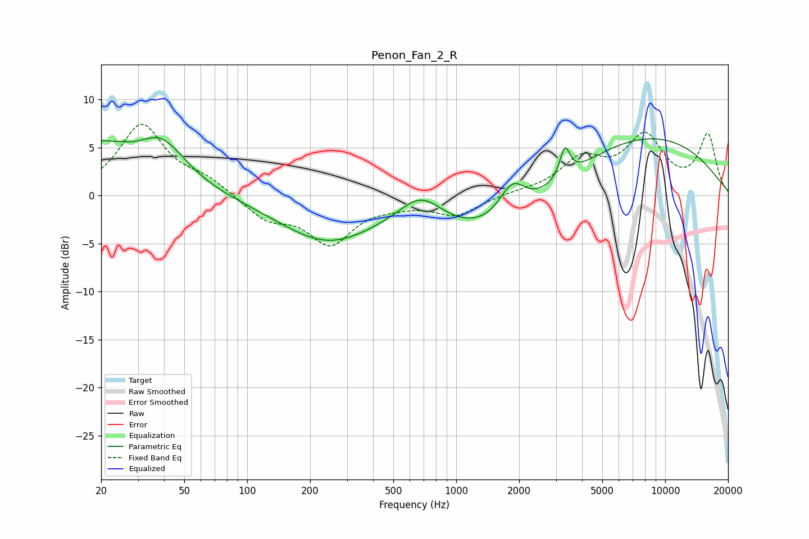

# Penon_Fan_2_R
See [usage instructions](https://github.com/jaakkopasanen/AutoEq#usage) for more options and info.

### Parametric EQs
Apply preamp of -6.1 dB when using parametric equalizer.

|   # | Type    |   Fc (Hz) |    Q |   Gain (dB) |
|-----|---------|-----------|------|-------------|
|   1 | Peaking |        20 | 5.74 |         1.2 |
|   2 | Peaking |        22 | 1.54 |         3.3 |
|   3 | Peaking |        38 | 1.14 |         5.3 |
|   4 | Peaking |        54 | 0.93 |         0.1 |
|   5 | Peaking |       239 | 0.62 |        -4.6 |
|   6 | Peaking |       678 | 1.33 |         3.2 |
|   7 | Peaking |      1626 | 0.44 |        -5.4 |
|   8 | Peaking |      1854 | 2.23 |         3.5 |
|   9 | Peaking |      3312 | 5.96 |         3.1 |
|  10 | Peaking |      7170 | 0.3  |         6.7 |

### Fixed Band EQs
When using fixed band (also called graphic) equalizer, apply preamp of **-7.5 dB** (if available) and set gains manually with these parameters.

|   # | Type    |   Fc (Hz) |    Q |   Gain (dB) |
|-----|---------|-----------|------|-------------|
|   1 | Peaking |        31 | 1.41 |         7.3 |
|   2 | Peaking |        62 | 1.41 |         1.4 |
|   3 | Peaking |       125 | 1.41 |        -2.3 |
|   4 | Peaking |       250 | 1.41 |        -4.8 |
|   5 | Peaking |       500 | 1.41 |        -0.6 |
|   6 | Peaking |      1000 | 1.41 |        -2   |
|   7 | Peaking |      2000 | 1.41 |         0.2 |
|   8 | Peaking |      4000 | 1.41 |         3.5 |
|   9 | Peaking |      8000 | 1.41 |         5.8 |
|  10 | Peaking |     16000 | 1.41 |         6.2 |

### Graphs

