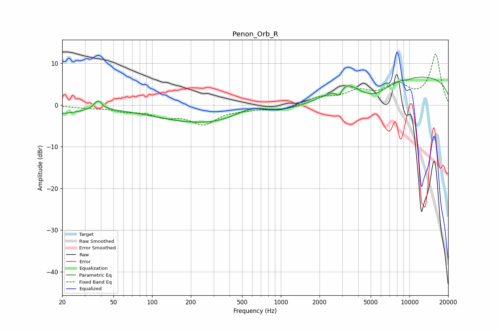

# Penon_Orb_R
See [usage instructions](https://github.com/jaakkopasanen/AutoEq#usage) for more options and info.

### Parametric EQs
Apply preamp of -6.8 dB when using parametric equalizer.

|   # | Type    |   Fc (Hz) |    Q |   Gain (dB) |
|-----|---------|-----------|------|-------------|
|   1 | Peaking |        20 | 0.96 |        -1.8 |
|   2 | Peaking |        38 | 4.69 |         2.2 |
|   3 | Peaking |       498 | 0.22 |        -6   |
|   4 | Peaking |       592 | 1    |         3.1 |
|   5 | Peaking |      1353 | 0.29 |         1.8 |
|   6 | Peaking |      2833 | 5.56 |        -2.1 |
|   7 | Peaking |      3176 | 1.88 |         2.3 |
|   8 | Peaking |      5200 | 1.11 |        -4.1 |
|   9 | Peaking |      9734 | 5.99 |        -0.3 |
|  10 | Peaking |     10000 | 0.18 |         7.2 |

### Fixed Band EQs
When using fixed band (also called graphic) equalizer, apply preamp of **-12.3 dB** (if available) and set gains manually with these parameters.

|   # | Type    |   Fc (Hz) |    Q |   Gain (dB) |
|-----|---------|-----------|------|-------------|
|   1 | Peaking |        31 | 1.41 |        -0.5 |
|   2 | Peaking |        62 | 1.41 |        -1.2 |
|   3 | Peaking |       125 | 1.41 |        -2.3 |
|   4 | Peaking |       250 | 1.41 |        -4.2 |
|   5 | Peaking |       500 | 1.41 |        -0.7 |
|   6 | Peaking |      1000 | 1.41 |        -1.3 |
|   7 | Peaking |      2000 | 1.41 |         1.7 |
|   8 | Peaking |      4000 | 1.41 |         2.9 |
|   9 | Peaking |      8000 | 1.41 |         4.4 |
|  10 | Peaking |     16000 | 1.41 |        12.1 |

### Graphs

