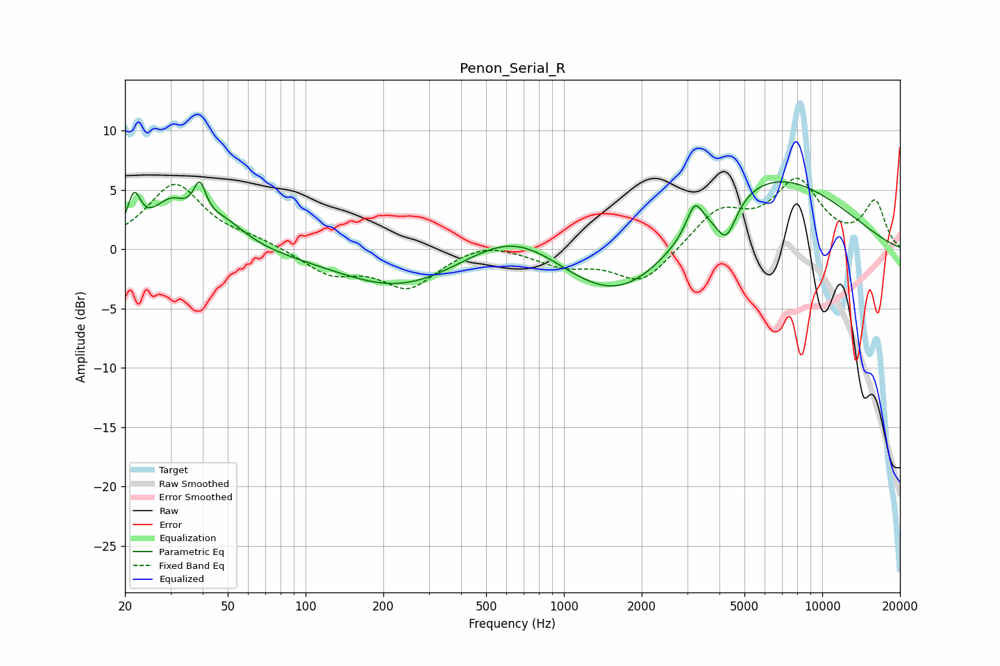

# Penon_Serial_R
See [usage instructions](https://github.com/jaakkopasanen/AutoEq#usage) for more options and info.

### Parametric EQs
Apply preamp of -5.8 dB when using parametric equalizer.

|   # | Type    |   Fc (Hz) |    Q |   Gain (dB) |
|-----|---------|-----------|------|-------------|
|   1 | Peaking |        22 | 5.52 |         3.3 |
|   2 | Peaking |        30 | 1.94 |         3.4 |
|   3 | Peaking |        39 | 6    |         2.9 |
|   4 | Peaking |        48 | 1.63 |         2   |
|   5 | Peaking |       232 | 0.58 |        -3.3 |
|   6 | Peaking |       649 | 0.76 |         3.1 |
|   7 | Peaking |      1663 | 0.6  |        -5.8 |
|   8 | Peaking |      3208 | 4.57 |         2.4 |
|   9 | Peaking |      4249 | 3.45 |        -3.2 |
|  10 | Peaking |      5882 | 0.43 |         6.8 |

### Fixed Band EQs
When using fixed band (also called graphic) equalizer, apply preamp of **-6.1 dB** (if available) and set gains manually with these parameters.

|   # | Type    |   Fc (Hz) |    Q |   Gain (dB) |
|-----|---------|-----------|------|-------------|
|   1 | Peaking |        31 | 1.41 |         5.4 |
|   2 | Peaking |        62 | 1.41 |         0.6 |
|   3 | Peaking |       125 | 1.41 |        -2   |
|   4 | Peaking |       250 | 1.41 |        -3.1 |
|   5 | Peaking |       500 | 1.41 |         0.8 |
|   6 | Peaking |      1000 | 1.41 |        -1.3 |
|   7 | Peaking |      2000 | 1.41 |        -2.9 |
|   8 | Peaking |      4000 | 1.41 |         3.1 |
|   9 | Peaking |      8000 | 1.41 |         5.4 |
|  10 | Peaking |     16000 | 1.41 |         3.9 |

### Graphs

