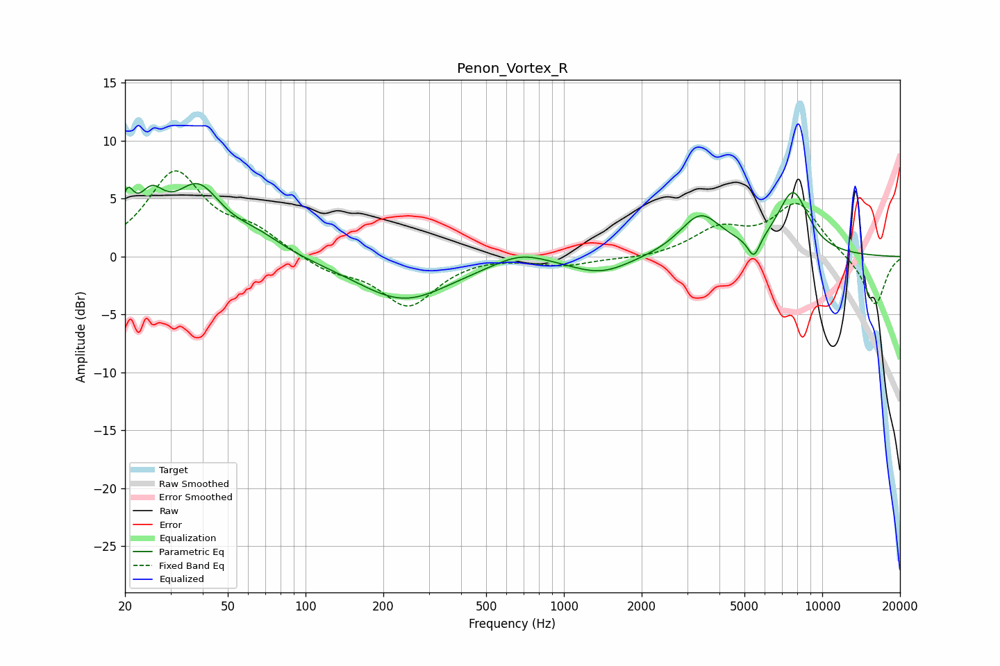

# Penon_Vortex_R
See [usage instructions](https://github.com/jaakkopasanen/AutoEq#usage) for more options and info.

### Parametric EQs
Apply preamp of -6.4 dB when using parametric equalizer.

|   # | Type    |   Fc (Hz) |    Q |   Gain (dB) |
|-----|---------|-----------|------|-------------|
|   1 | Peaking |        20 | 5.81 |         3.3 |
|   2 | Peaking |        25 | 2.72 |         3.6 |
|   3 | Peaking |        38 | 1.52 |         5.4 |
|   4 | Peaking |        65 | 1.38 |         1.3 |
|   5 | Peaking |       240 | 0.77 |        -3.8 |
|   6 | Peaking |       679 | 1.47 |         1   |
|   7 | Peaking |      1391 | 1.22 |        -1.5 |
|   8 | Peaking |      3379 | 1.73 |         3.5 |
|   9 | Peaking |      5437 | 5.8  |        -1.9 |
|  10 | Peaking |      7710 | 2.16 |         5.4 |

### Fixed Band EQs
When using fixed band (also called graphic) equalizer, apply preamp of **-7.5 dB** (if available) and set gains manually with these parameters.

|   # | Type    |   Fc (Hz) |    Q |   Gain (dB) |
|-----|---------|-----------|------|-------------|
|   1 | Peaking |        31 | 1.41 |         7.1 |
|   2 | Peaking |        62 | 1.41 |         1.9 |
|   3 | Peaking |       125 | 1.41 |        -1.2 |
|   4 | Peaking |       250 | 1.41 |        -4.2 |
|   5 | Peaking |       500 | 1.41 |         0.2 |
|   6 | Peaking |      1000 | 1.41 |        -0.7 |
|   7 | Peaking |      2000 | 1.41 |        -0.2 |
|   8 | Peaking |      4000 | 1.41 |         2.2 |
|   9 | Peaking |      8000 | 1.41 |         4.5 |
|  10 | Peaking |     16000 | 1.41 |        -4.3 |

### Graphs

