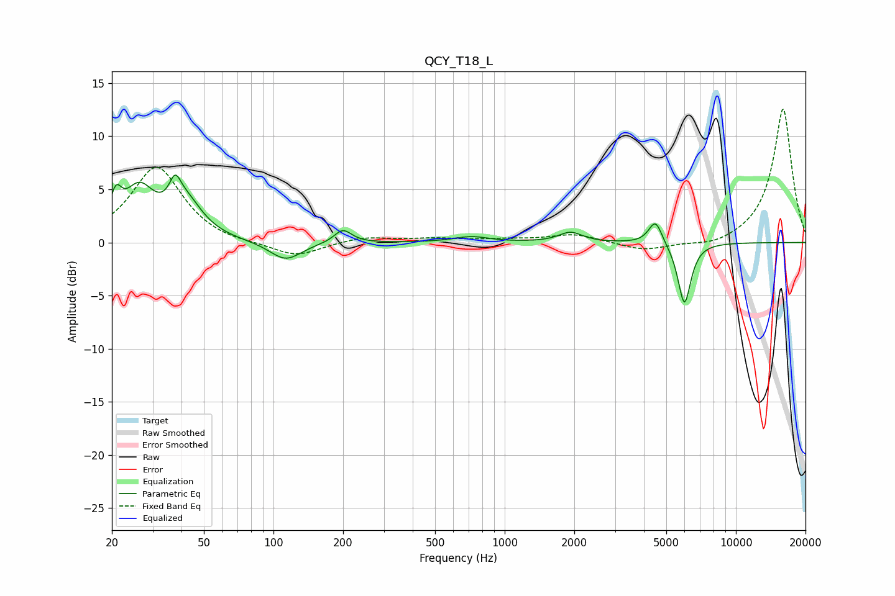

# QCY_T18_L
See [usage instructions](https://github.com/jaakkopasanen/AutoEq#usage) for more options and info.

### Parametric EQs
Apply preamp of -6.5 dB when using parametric equalizer.

|   # | Type    |   Fc (Hz) |    Q |   Gain (dB) |
|-----|---------|-----------|------|-------------|
|   1 | Peaking |        21 | 5.84 |         2.8 |
|   2 | Peaking |        26 | 2.15 |         4.5 |
|   3 | Peaking |        38 | 5.89 |         2.2 |
|   4 | Peaking |        42 | 1.95 |         3.3 |
|   5 | Peaking |       113 | 2.06 |        -1.8 |
|   6 | Peaking |       200 | 3.8  |         1.3 |
|   7 | Peaking |       718 | 1.94 |         0.5 |
|   8 | Peaking |      1926 | 2.83 |         0.9 |
|   9 | Peaking |      4488 | 4.8  |         2.3 |
|  10 | Peaking |      5988 | 4.96 |        -5.9 |

### Fixed Band EQs
When using fixed band (also called graphic) equalizer, apply preamp of **-12.6 dB** (if available) and set gains manually with these parameters.

|   # | Type    |   Fc (Hz) |    Q |   Gain (dB) |
|-----|---------|-----------|------|-------------|
|   1 | Peaking |        31 | 1.41 |         7.2 |
|   2 | Peaking |        62 | 1.41 |        -0.3 |
|   3 | Peaking |       125 | 1.41 |        -1.4 |
|   4 | Peaking |       250 | 1.41 |         0.5 |
|   5 | Peaking |       500 | 1.41 |         0.3 |
|   6 | Peaking |      1000 | 1.41 |         0.2 |
|   7 | Peaking |      2000 | 1.41 |         0.8 |
|   8 | Peaking |      4000 | 1.41 |        -0.8 |
|   9 | Peaking |      8000 | 1.41 |        -0.5 |
|  10 | Peaking |     16000 | 1.41 |        12.7 |

### Graphs

