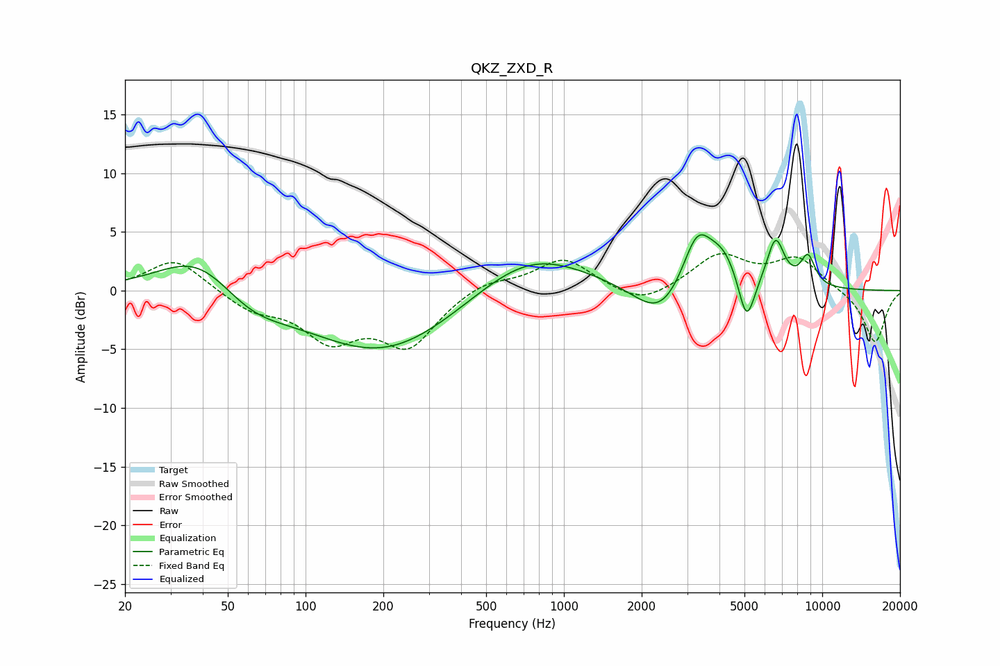

# QKZ_ZXD_R
See [usage instructions](https://github.com/jaakkopasanen/AutoEq#usage) for more options and info.

### Parametric EQs
Apply preamp of -4.8 dB when using parametric equalizer.

|   # | Type    |   Fc (Hz) |    Q |   Gain (dB) |
|-----|---------|-----------|------|-------------|
|   1 | Peaking |        38 | 0.92 |         3.6 |
|   2 | Peaking |        61 | 1.06 |        -1.9 |
|   3 | Peaking |       202 | 0.49 |        -5.5 |
|   4 | Peaking |       734 | 0.65 |         3.8 |
|   5 | Peaking |      2372 | 1.41 |        -3.1 |
|   6 | Peaking |      3279 | 2.39 |         4.8 |
|   7 | Peaking |      4155 | 2.22 |         2.6 |
|   8 | Peaking |      5095 | 4.33 |        -4.3 |
|   9 | Peaking |      6598 | 3.99 |         4.1 |
|  10 | Peaking |      8801 | 4.47 |         2.6 |

### Fixed Band EQs
When using fixed band (also called graphic) equalizer, apply preamp of **-3.2 dB** (if available) and set gains manually with these parameters.

|   # | Type    |   Fc (Hz) |    Q |   Gain (dB) |
|-----|---------|-----------|------|-------------|
|   1 | Peaking |        31 | 1.41 |         2.8 |
|   2 | Peaking |        62 | 1.41 |        -1.5 |
|   3 | Peaking |       125 | 1.41 |        -3.8 |
|   4 | Peaking |       250 | 1.41 |        -4.5 |
|   5 | Peaking |       500 | 1.41 |         1   |
|   6 | Peaking |      1000 | 1.41 |         2.7 |
|   7 | Peaking |      2000 | 1.41 |        -1.4 |
|   8 | Peaking |      4000 | 1.41 |         2.9 |
|   9 | Peaking |      8000 | 1.41 |         2.7 |
|  10 | Peaking |     16000 | 1.41 |        -4.5 |

### Graphs

