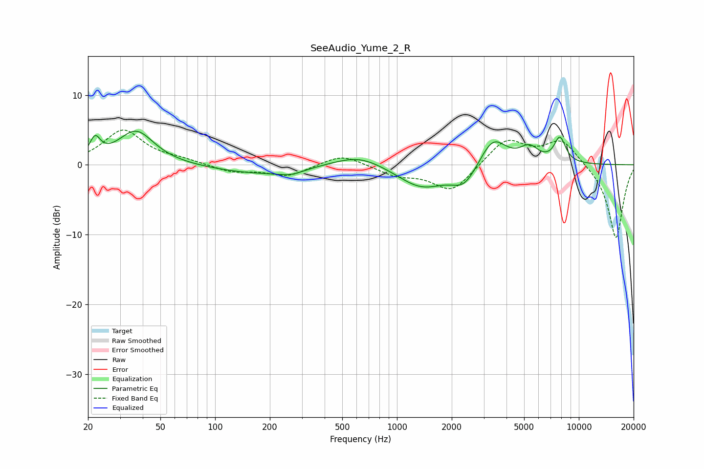

# SeeAudio_Yume_2_R
See [usage instructions](https://github.com/jaakkopasanen/AutoEq#usage) for more options and info.

### Parametric EQs
Apply preamp of -4.9 dB when using parametric equalizer.

|   # | Type    |   Fc (Hz) |    Q |   Gain (dB) |
|-----|---------|-----------|------|-------------|
|   1 | Peaking |        22 | 4.87 |         2.8 |
|   2 | Peaking |        37 | 1.43 |         4.9 |
|   3 | Peaking |       169 | 0.6  |        -1.2 |
|   4 | Peaking |       261 | 2.05 |        -0.7 |
|   5 | Peaking |       619 | 1.02 |         1.8 |
|   6 | Peaking |      1368 | 1.04 |        -3.3 |
|   7 | Peaking |      2347 | 2.04 |        -2.8 |
|   8 | Peaking |      3371 | 1.91 |         4.2 |
|   9 | Peaking |      5334 | 2.69 |         2.1 |
|  10 | Peaking |      7870 | 4.2  |         3.6 |

### Fixed Band EQs
When using fixed band (also called graphic) equalizer, apply preamp of **-5.1 dB** (if available) and set gains manually with these parameters.

|   # | Type    |   Fc (Hz) |    Q |   Gain (dB) |
|-----|---------|-----------|------|-------------|
|   1 | Peaking |        31 | 1.41 |         4.9 |
|   2 | Peaking |        62 | 1.41 |         0.6 |
|   3 | Peaking |       125 | 1.41 |        -1   |
|   4 | Peaking |       250 | 1.41 |        -1.6 |
|   5 | Peaking |       500 | 1.41 |         1.6 |
|   6 | Peaking |      1000 | 1.41 |        -1.4 |
|   7 | Peaking |      2000 | 1.41 |        -3.9 |
|   8 | Peaking |      4000 | 1.41 |         3.8 |
|   9 | Peaking |      8000 | 1.41 |         3.6 |
|  10 | Peaking |     16000 | 1.41 |       -10.7 |

### Graphs

